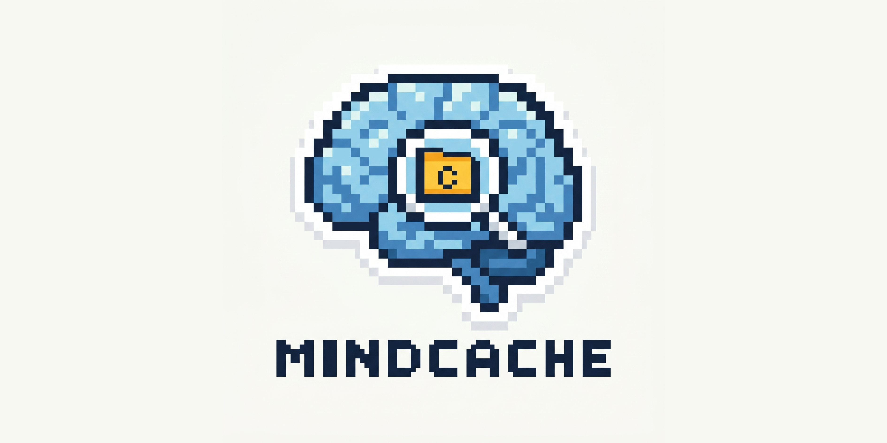
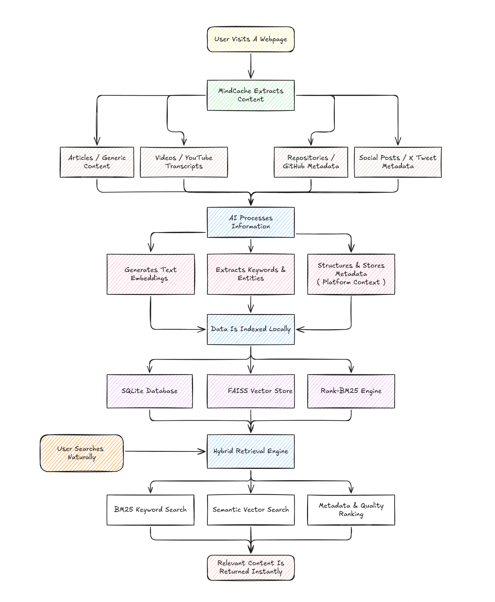

<p align="center">
  
</p>

# MindCache

> An AI-powered, completely local personal browser memory assistant. MindCache runs entirely on your local machine to scrape, index, summarize, and semantically search web pages you visit, ensuring absolute privacy for your browsing history.

---

## Quick Start

```bash
# 1. Start the backend
cd backend
uv sync
uv run uvicorn app.main:app --reload

# 2. Build the extension (in another terminal)
cd extension
npm install
npm run build
```

1. Load `extension/dist/` as an unpacked extension in Chrome/Brave (`chrome://extensions` → Developer mode → Load unpacked).

> **Ollama required** for AI features:
>
> ```bash
> ollama pull qwen3.5:2b
> ollama pull embeddinggemma:300m
> ```

---

## Documentation

Everything is in the [`docs/`](docs/README.md) directory:

| Doc | What It Covers |
|---|---|
| [Index / Quick Start](docs/README.md) | Landing page, prerequisites, backend + extension setup |
| [Architecture](docs/Architecture.md) | System context, ingestion pipeline, extension modules, retrieval |
| [API Reference](docs/API.md) | All REST endpoints with request/response examples |
| [AI Pipeline](docs/AI-Pipeline.md) | Embeddings, FAISS search, Ollama summarization |
| [Platform Extraction](docs/Platform-Extraction.md) | YouTube, X/Twitter extractors, factory pattern |
| [Setup Guide](docs/Setup.md) | Backend config, migrations, testing, linting |
| [Development Guide](docs/Development.md) | Extension build, project structure, constants, context menus |
| [Study Guide](docs/Study.md) | Deep-dive into search, embeddings, vector databases, RAG |

---

## Core Features

- **Absolute Local Privacy** — Zero cloud API calls. All indexing, vector computation, and AI synthesis runs on localhost with no external dependencies.
- **Background Tab Tracking** — Extension monitors tab activations, navigation, closures, and window focus. Computes exact dwell time per tab. Auto-indexes after a 10-second threshold. Deduplicates rapid revisits.
- **Path & Extension Blacklists** — Automatically filters out login pages (`/login`, `/signup`, `/admin`), binary files (`.exe`, `.dmg`, `.zip`), images (`.png`, `.jpg`), and documents (`.pdf`, `.docx`) to keep the index clean.
- **Client-Side Extraction** — Uses the Defuddle library (from Obsidian Web Clipper) to extract page content directly from the DOM. Includes shadow DOM flattening, noise removal (`<nav>`, `<footer>`, `.sidebar`), URL absolutification, and an 8-second Defuddle timeout with sync fallback. Works behind auth/paywalls and on JS-rendered SPAs.
- **Four Capture Methods**:
  - **Automatic**: Dwell-time-based auto-indexing (configurable via auto-extract toggle).
  - **Keyboard**: `Ctrl+Shift+S` to save the current page instantly.
  - **Popup**: "Save to MindCache" button appears when auto-tracking or auto-extraction is off.
  - **Context Menu**: Right-click on a page, link, or text selection to save to MindCache.
- **Auto-Extraction Toggle** — When disabled, pages are tracked (URL + dwell time) but not extracted or sent to the backend until the user explicitly captures them. Useful for selective indexing and reducing backend load.
- **Flexible Extraction Pipeline** — If client-side extraction is unavailable (chrome:// pages, PDF viewer), the backend falls back to server-side download via Trafilatura/BeautifulSoup. Platform-specific extractors handle YouTube (yt-dlp + transcripts) and X/Twitter (syndication API).
- **Hybrid Search** — Combines FAISS vector similarity (cosine, 768d), BM25 lexical matching, title/keyword overlap, platform metadata scoring, and recency decay into a weighted fusion formula. Results below a 0.15 score floor are filtered out.
- **Dynamic Quality Boosts** — Documents are ranked higher based on dwell time (>60s), word count (>500), source type (GitHub/PDF/docs), transcript availability, and revisit count. Click signals add up to +0.30 boost per query.
- **Local RAG Summarization** — Ollama (`qwen3.5:2b`) generates page summaries on ingestion and collective AI synthesis with inline citations on search.
- **Spotlight Search UI** — Keyboard-first popup (`Ctrl+Shift+K`) with debounced query updates, relevance percentage scores, domain badges, keyword tags, and match classification (Best Match ≥65%, Strong Match ≥55%).
- **Interactive Knowledge Graph** — Visualize documents, entities (Persons, Companies, Technologies, Projects), and keywords with co-occurrence edges. Supports entity color-coding, keyword frequency filtering, and multiple color modes.
- **Privacy Controls** — Auto-tracking toggle, auto-extraction toggle, private search logging mode, per-domain exclusion list, and path/extension blacklists.

---

## Project Structure

```
MindCache/
├── backend/          # FastAPI server (Python)
│   ├── app/          # API routes, services, models
│   ├── tests/        # Pytest suite (32 tests)
│   └── data/         # SQLite + FAISS + BM25 storage
├── extension/        # Browser extension (TypeScript/React)
│   ├── src/          # Background, content, popup, settings
│   ├── tests/        # Vitest suite (10 tests)
│   ├── dist/         # Build output (content.js 459KB, background.js 28KB)
│   └── public/       # Manifest V3
└── docs/             # Unified documentation (8 files)
```

---

## Architecture Overview


