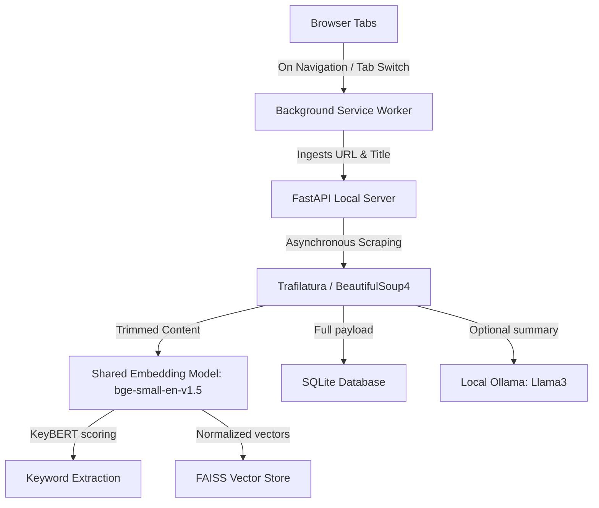

<p align="center">
  
</p>

# MindCache

> An AI-powered, completely local personal browser memory assistant. MindCache runs entirely on your local machine to scrape, index, summarize, and semantically search web pages you visit, ensuring absolute privacy for your browsing history.

---

## Architecture Overview

MindCache operates offline, coordinating a background tab monitor with a local vector and relational database pipeline.



---

## Core Features

- **Absolute Local Privacy**: Zero external cloud or API calls. All indexing, vector computations, relational database storage, and AI syntheses occur on your localhost.
- **Background Ingestion & Tab Tracking**: The Chromium extension automatically registers visited URLs and pre-rendered tab titles, using debounces and domain exclusion rules.
- **Hybrid Content Scraping**: Utilizes specialized extraction pipelines for YouTube, X (Twitter), and Reddit (to capture subreddits, posts, and top discussion comments), falling back gracefully to Trafilatura and BeautifulSoup4 for generic web content.
- **Memory-Optimized Local NLP**: Shares a single pre-loaded `BAAI/bge-small-en-v1.5` SentenceTransformer instance between vector search and KeyBERT keyword extraction, saving over 500MB of local system memory.
- **Spotlight Semantic Search**: Executes high-performance Cosine Similarity matches on FAISS inner product indices with real-time, debounced query auto-updates.
- **Local RAG Chat Synthesis**: Connects directly to local Ollama installations (e.g. `llama3`) to construct dynamic syntheses and answers from your browsing history with inline citations.

---

## Project Structure

MindCache is divided into two distinct components:

- **[`/backend`](backend/README.md)**: High-performance FastAPI server managing scrapers, local models (SentenceTransformer/KeyBERT), aiosqlite/SQLAlchemy ORM, and FAISS indices.
- **[`/extension`](extension/README.md)**: Manifest V3 browser extension and a full-featured spotlight dashboard built with React, TypeScript, Radix UI, Zustand, and TailwindCSS.

---

## Quick Start

### 1. Launch the Backend Server

Ensure you have Python 3.12+ installed. We recommend using `uv` for fast package management.

```bash
cd backend
# Install dependencies and sync virtual environment
uv sync

# Run the database migrations and start the server
uv run uvicorn app.main:app --reload
```

The server initializes the SQLite database at `backend/data/mindcache.db` and is reachable at `http://localhost:8000`.

### 2. Set Up the Browser Extension

Ensure you have Node.js 18+ installed.

```bash
cd extension
# Install dependencies
npm install

# Build the extension
npm run build
```

This generates compiled assets in `extension/dist`.

### 3. Load the Extension into your Browser

1. Navigate to the extensions page in your Chromium-based browser (e.g., `chrome://extensions` or `brave://extensions`).
2. Toggle **Developer mode** in the top right.
3. Click **Load unpacked** in the top left.
4. Select the `extension/dist` folder.

---

> [!IMPORTANT]
> **Ollama Integration**  
> To leverage RAG chat synthesis and automated page summarization, ensure [Ollama](https://ollama.ai/) is running locally and has the `llama3` model pulled:
>
> ```bash
> ollama pull llama3
> ```
