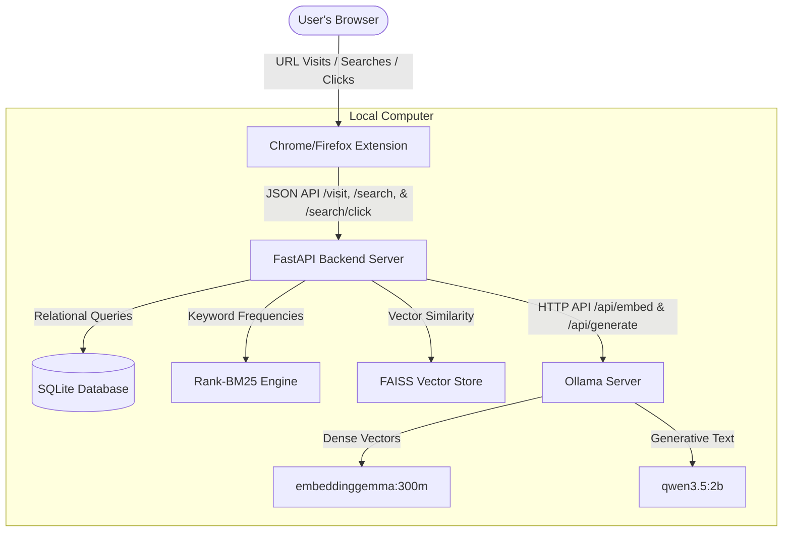
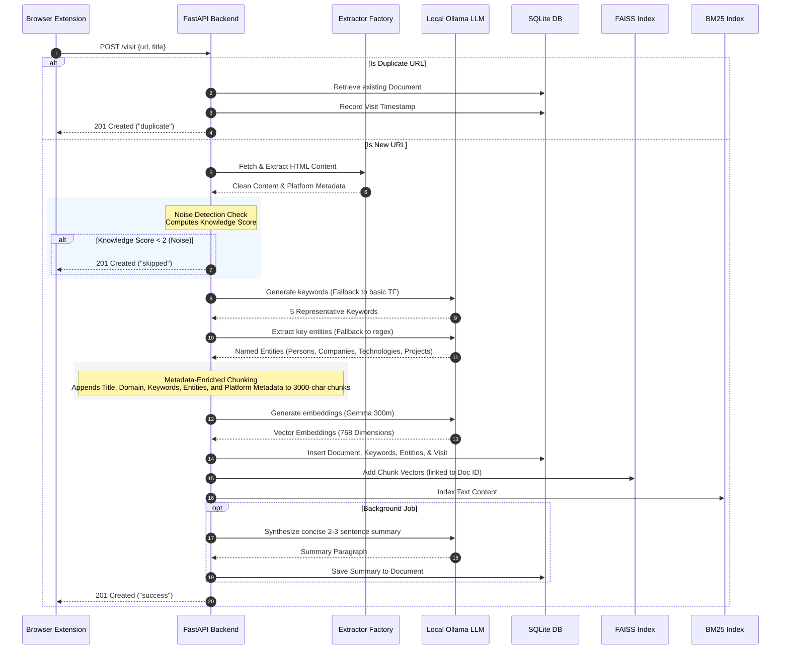
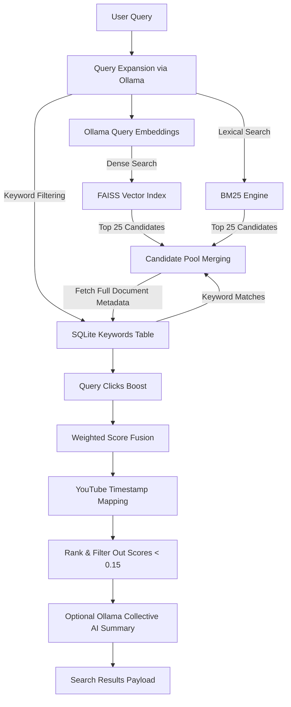

# MindCache: System Architecture Blueprint

MindCache is an AI-powered personal browser memory engine designed to run **100% locally**. It intercepts webpage visits, parses clean reading text, extracts key entities, builds hybrid search indices, and uses local AI models to search, synthesize, and organize web history without leaking data.

---

## 1. System Context Diagram



---

## 2. Ingestion Pipeline (Recording a Visit)

When you visit a URL in the browser, the extension sends the URL to the backend. The following sequence occurs:



### Noise Detection Metrics

The `knowledge_score` determines if a page is worth indexing:

- **Word count > 300**: $+2$ points
- **Unique words > 100**: $+2$ points
- **URL path is not root (`/`)**: $+1$ point
- **Platform Match (GitHub, YouTube, Reddit)**: $+2$ points
- _Skip vector/BM25 indexing if score is less than 2._

### Metadata-Enriched Chunking

Before sending text to the embedding model, pages longer than 3000 characters are split into overlapping blocks. To prevent the loss of semantic context, each chunk is prepended with:

```text
Title: {title}
Domain: {domain}
Source Type: {source_type}
Keywords: {k1, k2, ...}
Entities: {name:type, ...}
Metadata: {source-specific metadata strings}
Content (Chunk X/Y): {text}
```

---

## 3. Entity & Analytics Storage (SQLite Schema)

In addition to traditional document retrieval indices, MindCache extracts entities and monitors user clicks to boost results:

1. **Entities Table (`entities`)**: Connects document IDs to specific extracted items like **Persons** (e.g. Andrej Karpathy), **Companies** (e.g. Google), **Technologies/Libraries** (e.g. PyTorch, FAISS), and **Projects** (e.g. MindCache).
2. **Search Clicks Table (`search_clicks`)**: Logs query strings against clicked document IDs to power click-relevance ranking feedback.
3. **Search Queries Table (`search_queries`)**: Logs all user search queries to track research history and query/intent analytics over time.

---

## 4. Retrieval Pipeline (Hybrid Search & Ranking)

MindCache uses a hybrid retrieval pipeline that blends lexical search, vector similarity, title-matching heuristic boosts, and recency decay.



### Weighted Score Fusion Formula

Instead of utilizing expensive, slow deep learning rerankers on CPU, candidate pages are ranked using a custom weighted fusion of six distinct components:

$$\text{final\_score} = 0.55 \cdot V_{\text{score}} + 0.25 \cdot B_{\text{score}} + 0.10 \cdot T_{\text{score}} + 0.05 \cdot K_{\text{score}} + 0.02 \cdot R_{\text{score}} + 0.03 \cdot S_{\text{score}}$$

1. **Vector Score ($V_{\text{score}}$)**: FAISS Cosine Similarity score, normalized to $[0, 1]$.
2. **BM25 Score ($B_{\text{score}}$)**: Lexical score normalized against the maximum score in the current candidate set.
3. **Title Score ($T_{\text{score}}$)**: Proportion of query terms found directly in the webpage's title string.
4. **Keyword Score ($K_{\text{score}}$)**: Overlap proportion between the query terms and the keywords extracted at ingestion time.
5. **Recency Score ($R_{\text{score}}$)**: Time-decay function prioritizing recently read files (capped at a weight of $0.02$ to prevent overpowering relevance):
   $$R_{\text{score}} = e^{-\frac{\text{days since last visit}}{30}}$$
6. **Source Score ($S_{\text{score}}$)**: Developer-oriented source type boost ($1.0$ for GitHub, $0.5$ for YouTube, Reddit, X, $0.0$ for generic).

### Rank Overrides & Refinements

- **Click Boost**: Documents previously clicked for the exact same search query get a rank boost of $+0.10$ per click (capped at $+0.30$).
  $$\text{score} = \min(\text{final\_score} + \text{click\_boost}, 1.0)$$
- **YouTube Timestamping**: During caption ingestion, transcripts are formatted with time markers (e.g. `[12:30]`). When a query matches within a YouTube video, the system dynamically calculates the nearest timestamp and appends it to the result title (e.g. `(Found at 12:30)`).

---

## 5. Key Configuration Files

- **[.env](../.env)**: Sets the backend ports, model names, and base URL directions.
- **[config.py](../app/core/config.py)**: Loads configuration options and sets defaults for environment variables.
- **[main.py](../app/main.py)**: Launches FastAPI, connects routes, and triggers background checks for local database re-indexing on lifespan start.
