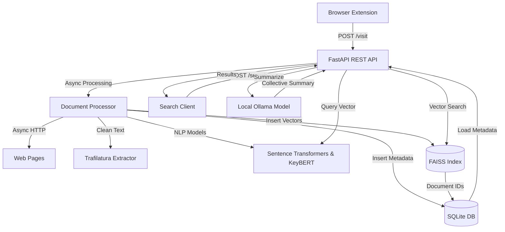

# Architecture

This document describes the design and components of MindCache, a local browser memory system.

## System Design

MindCache runs entirely on your local machine. It stores web content, extracts insights, and provides search capabilities. The system guarantees privacy because it performs all operations locally.

## Separation of Concerns

MindCache separates responsibilities into distinct layers.

- **API Layer (`app/api/`)**: Exposes REST endpoints. Validates requests with Pydantic schemas. Handles HTTP errors and returns consistent responses.
- **Service Layer (`app/services/`)**: Orchestrates business logic. Handles web page downloads, schedules extraction pipelines, manages vector operations, and interfaces with Ollama.
- **Repository Layer (`app/repositories/`)**: Handles database queries and writes. Prevents raw database commands from leaking into business logic.
- **Data Layer (`app/models/` & `app/db/`)**: Establishes database connection pools, transaction contexts, and schemas.
- **Schema Layer (`app/schemas/`)**: Defines data serialization structures for client requests and api responses.

## Data Flow

### Ingestion Flow

1. The browser extension sends a visited URL to `POST /visit`.
2. The endpoint verifies the URL structure.
3. The database checker looks for duplicate entries. If found, the system records a new visit and skips further processing.
4. For new URLs, an asynchronous client downloads the webpage html.
5. Trafilatura extracts structured article text and publication metadata. If it fails, BeautifulSoup4 extracts the text block.
6. KeyBERT extracts five keywords and scores.
7. SentenceTransformers encodes the page text into a 384-dimensional vector.
8. The system commits the webpage record, visit timestamp, and keywords to SQLite.
9. FAISS registers the vector mapped to the database ID.
10. If a local Ollama server runs, it generates a concise article summary and updates the record.

### Search Flow

1. You send a search query and a summarization flag to `POST /search`.
2. SentenceTransformers converts your natural language query into a vector.
3. FAISS performs an inner product search to find the closest cosine matches.
4. SQLite resolves full details for the returned document IDs, maintaining relevance order.
5. If requested and active, Ollama synthesizes the retrieved contents to compile a single cohesive response.
6. The API returns the documents list and the synthesis.
