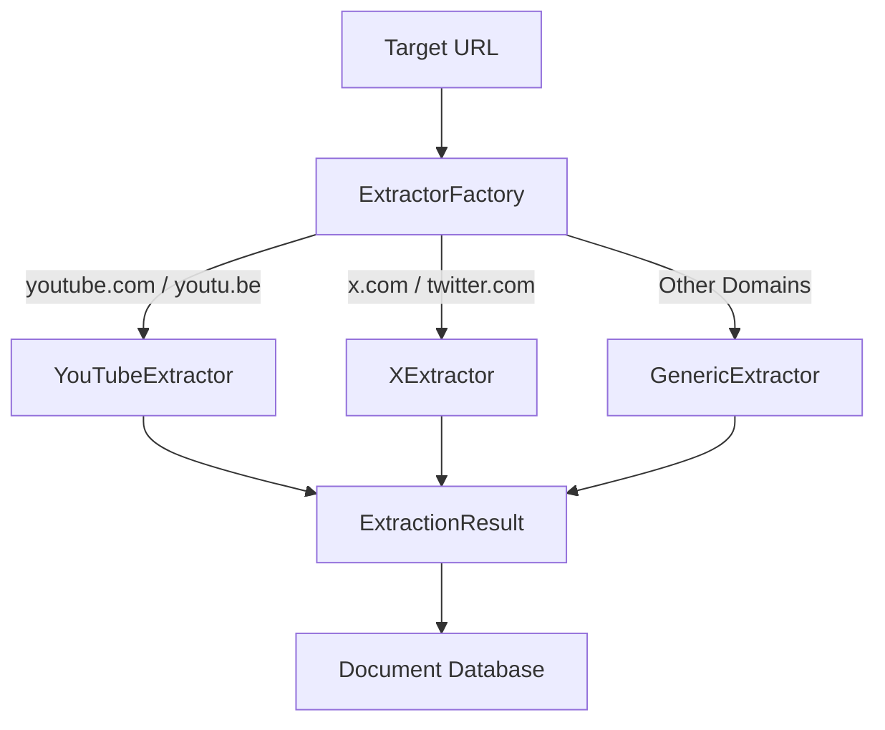

# Platform-Specific Content Extraction

This document explains the provider-based architecture for extracting platform-specific content (such as YouTube transcripts or X tweet metadata) within the MindCache system.

## Overview

Traditional HTML parsers fail on modern, Javascript-rendered platforms like YouTube and X (Twitter). Instead of scattering conditional domain checks throughout the document processor, MindCache uses a provider-based extraction pipeline that delegates processing to platform-specific classes.



---

## Architecture Components

The extraction system lives in the `app/services/extractors/` package and consists of these core components:

1. **`ContentExtractor` (Base Class)**: An abstract interface that all extractors implement.
2. **`ExtractionResult` (Dataclass)**: A strongly-typed container carrying clean extracted content, standard metadata (title, author, date), a source type identifier, and structured platform-specific JSON metadata.
3. **`ExtractorFactory` (Factory Class)**: A centralized registry that maps domain hostnames to their corresponding extractor instance.
4. **Concrete Extractors**:
   - `GenericExtractor`: Standard Trafilatura/BeautifulSoup pipeline.
   - `YouTubeExtractor`: Integration for video details and transcripts.
   - `XExtractor`: Alternative public syndication scraper with metadata fallback.

---

## Factory Pattern and Extractor Registry

`ExtractorFactory` centralizes URL routing. This maintains a clean document processor that doesn't need to know which platform it is interacting with.

```python
# app/services/extractors/factory.py

class ExtractorFactory:
    _registry = {
        "youtube.com": YouTubeExtractor(),
        "youtu.be": YouTubeExtractor(),
        "x.com": XExtractor(),
        "twitter.com": XExtractor(),
    }

    @classmethod
    def get_extractor(cls, url: str) -> ContentExtractor:
        # Normalizes the URL domain, resolves subdomains,
        # and returns the matched extractor or GenericExtractor fallback.
```

---

## YouTube Ingestion Flow

The YouTubeExtractor aims to capture searchable knowledge from video links. 

* **Metadata Fetching**: Uses `yt-dlp` in skip-download mode to retrieve high-level metadata (channel, duration, description, tags, and upload date).
* **Transcript Extraction**: Uses `youtube-transcript-api` to pull raw captions. The transcript serves as the primary content source.

### Fallback Strategy

* **Transcript Available**:
  - `extracted_content` = Title + Description + Transcript
  - Embeddings and keywords generate directly from the transcript text.
* **Transcript Disabled or Missing (Shorts/Long Videos)**:
  - `extracted_content` = Title + Description + Tags
  - The pipeline proceeds gracefully using this metadata summary without throwing errors.
* **Structured Metadata Saved**:
  ```json
  {
    "video_id": "dQw4w9WgXcQ",
    "duration": 212,
    "channel": "Rick Astley",
    "tags": ["rickroll", "80s"],
    "transcript_available": true
  }
  ```

---

## X (Twitter) Ingestion Flow

Scraping X is highly restricted. The `XExtractor` uses a reliable, unauthenticated syndication API to scrape public tweet JSON data.

* **Parsing**: Extracts the username and tweet ID directly from the URL.
* **Syndication Request**: Targets `https://cdn.syndication.twimg.com/tweet-result?id={tweet_id}&lang=en` to fetch full tweet text, author's display name, and the timestamp.

### Fallback Strategy

If the syndication API fails (due to a private tweet, deleted record, or rate limits), the extractor activates its fallback path:

* Marks `partial_extraction = True`.
* Sets `extracted_content` using basic URL parameters (Username, Tweet ID).
* Prevents pipeline crashes by returning partial metadata instead of throwing exception cascades.
* **Structured Metadata Saved**:
  ```json
  {
    "author": "Jack",
    "tweet_id": "20",
    "timestamp": "2006-03-21T20:50:14",
    "partial_extraction": false
  }
  ```

---

## Future Extension Process (Add a New Extractor in Under 30 Minutes)

To integrate a new platform (e.g., `Reddit` or `GitHub`):

### Step 1: Create the Extractor Class

Create a new file in `app/services/extractors/` (e.g. `reddit.py`):

```python
# app/services/extractors/reddit.py
from app.services.extractors.base import ContentExtractor, ExtractionResult

class RedditExtractor(ContentExtractor):
    async def extract(self, url: str) -> ExtractionResult:
        # 1. Fetch Reddit JSON endpoint or HTML
        # 2. Extract title, body, author, date, and subreddit
        # 3. Handle errors gracefully and use fallback data if needed
        return ExtractionResult(
            content="Subreddit Post Content...",
            title="Reddit Post Title",
            author="reddit_user",
            source_type="Reddit",
            platform_metadata={
                "subreddit": "python",
                "upvotes": 42
            }
        )
```

### Step 2: Export from the Package

Add your class to the package interface file `app/services/extractors/__init__.py`:

```python
from app.services.extractors.reddit import RedditExtractor

__all__ = [
    # ...
    "RedditExtractor"
]
```

### Step 3: Register the Domains in the Factory

Add the target hostnames to `ExtractorFactory._registry` inside `app/services/extractors/factory.py`:

```python
# app/services/extractors/factory.py
from app.services.extractors.reddit import RedditExtractor

class ExtractorFactory:
    _reddit_extractor = RedditExtractor()

    _registry = {
        # Existing registrations...
        "reddit.com": _reddit_extractor,
        "old.reddit.com": _reddit_extractor,
    }
```

### Step 4: Write Unit Tests

Add domain matching and parsing tests to `tests/test_extractors.py` and run the test suite:

```bash
uv run pytest tests/test_extractors.py
```
