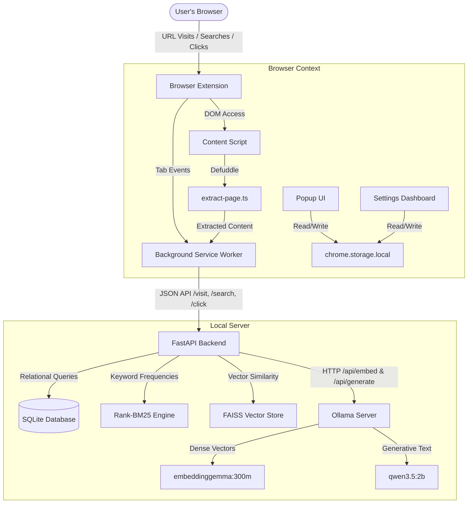
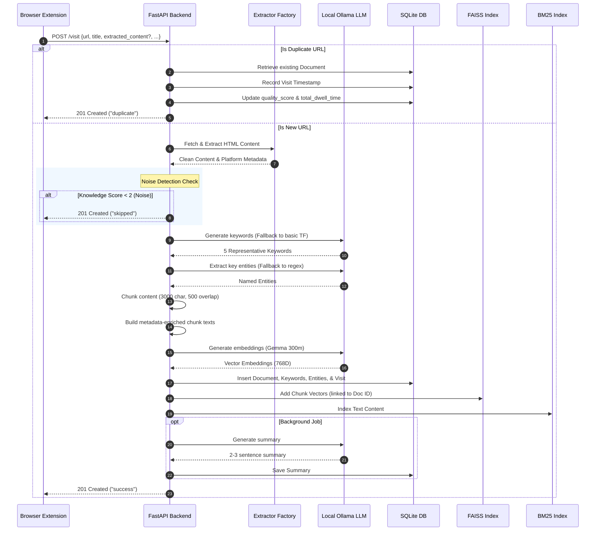
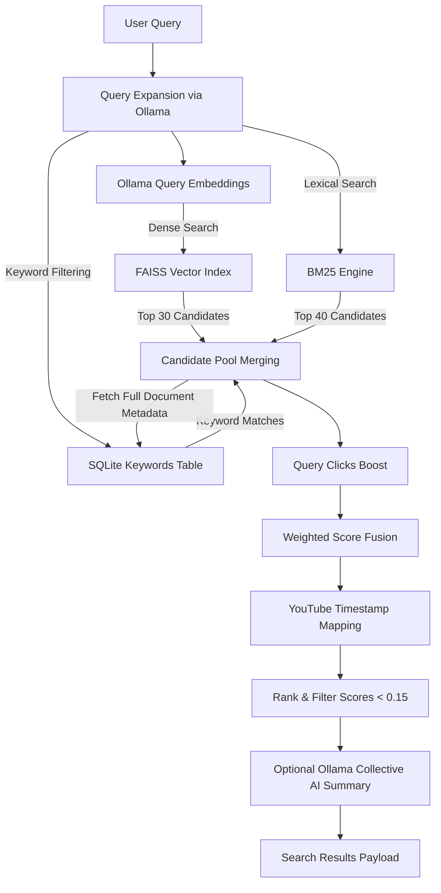

# Architecture

MindCache orchestrates a browser extension with a local FastAPI backend to provide private, AI-powered browsing history search.

## System Context



---

## Extension Architecture

### Content Extraction (`src/content/extract-page.ts`)

The content script runs in the page DOM context. When the background worker needs to record a visit, it pings the content script with `"extract-page"`. Extraction uses **Defuddle** (the same library used by Obsidian Web Clipper):

1. **Shadow DOM flattening** — recursively walks all elements, inlines `shadowRoot.innerHTML` so shadow DOM content is accessible.
2. **Noise removal** — strips `<nav>`, `<header>`, `<footer>`, `<aside>`, `<form>`, `<noscript>`, `[role="navigation"]`, `[role="banner"]`, `[role="contentinfo"]`, `.sidebar`, `.nav`, `.footer`, `.cookie` elements.
3. **URL absolutification** — rewrites `src`, `href`, `srcset` attributes to absolute URLs using `document.baseURI`.
4. **Defuddle parsing** — runs `Defuddle.parseAsync()` with an 8-second timeout, falling back to synchronous `Defuddle.parse()` on timeout.
5. **Turndown conversion** — converts extracted HTML to Markdown (ATX headings, fenced code blocks, inlined links).
6. **Sanitization** — removes `<script>`, `<style>`, `<noscript>` tags and inline `style` attributes.

The content script also handles `"ping"` (health check), `"toggle-overlay"` (search overlay), and `"extract-selection"` (context menu selection capture).

**Content Script Entry (`src/content/index.ts`)**:
- Sets up 3 message handlers: `ping`, `extract-page`, `extract-selection`
- Initializes the SearchOverlay React component inside an isolated Shadow DOM attached to `document.documentElement`
- Renders `<SearchOverlay />` via `React.createElement` and `createRoot`

### Background Service Worker (`src/background/index.ts`)

Monitors tab activations, navigation completions, closures, and window focus changes. Computes exact dwell time per tab.

**Visit filtering** (`shouldTrack()`):
- Protocol must be `http:` or `https:` (not `chrome-extension://`)
- `autoTracking` setting must be enabled
- Domain not in user exclusion list
- Path not in blacklist (`/login`, `/signup`, `/register`, `/logout`, `/reset-password`, `/forgot-password`, `/subscribe`, `/pricing`, `/checkout`, `/cart`, `/wp-admin`, `/admin`, `/auth`, `/signin`, `/oauth`, etc.)
- File extension not in blacklist (images: `.png`, `.jpg`, `.gif`, `.webp`; media: `.mp3`, `.mp4`; archives: `.zip`, `.tar`, `.gz`; binaries: `.exe`, `.dmg`; documents: `.pdf`, `.doc`, `.xls`, `.ppt`)

**Dwell time**: 10-second threshold (`DWELL_TIME_THRESHOLD_SEC`) before auto-indexing. Minimum 5 seconds (`MIN_DWELL_TIME_SEC`) to index on tab deactivation. Tab deactivation immediately records a visit with actual duration. Duplicate URLs within 10 seconds are suppressed (`recentVisits` Map, capped at 200 entries with LRU eviction).

**Event Listeners** (6 total):
1. `chrome.tabs.onActivated` — tab switch triggers `handleTabActivated()`
2. `chrome.tabs.onUpdated` (status === "complete") — navigation completion
3. `chrome.tabs.onRemoved` — tab closure triggers `handleTabDeactivated()`
4. `chrome.windows.onFocusChanged` — window blur deactivates, window focus re-activates current tab
5. `chrome.commands.onCommand` — `"toggle-search-overlay"` and `"capture-page"` handlers
6. `chrome.runtime.onMessage` — 7 message handlers for cross-context communication

**Message Handlers** (in `chrome.runtime.onMessage`):
- `"get-active-tabs"` — returns all open tabs with id, title, url, favIconUrl, active status
- `"search-memory"` — proxies to `backendClient.search()` and returns results
- `"check-backend-health"` — proxies to `backendClient.checkHealth()`
- `"get-current-extraction"` — extracts current page and returns extraction data
- `"capture-page"` — manually captures current page
- `"switch-to-tab"` — switches browser to a specific tab
- `"open-url"` — opens a URL in a new tab

**Auto-extraction toggle**: When off, `processVisit()` returns early — no content extraction, no backend call. User must explicitly capture via popup, keybind, or context menu.

**Three capture methods**:
1. Keyboard shortcut `Ctrl+Shift+S` — `chrome.commands.onCommand` → `captureCurrentPage()`
2. Popup "Save to MindCache" button — runtime message → same `captureCurrentPage()`
3. Context menu — three items created on `chrome.runtime.onInstalled`:
   - "Save this page to MindCache" (page context)
   - "Save this link to MindCache" (link context — records basic visit)
   - "Save selection to MindCache" (selection context — extracts selected text)

**Deduplication**: `recentVisits` Map caps at 200 entries, drops duplicates within 10 seconds.

### Spotlight Search Overlay (`src/content/SearchOverlay.tsx`)

Keyboard-first search window rendered in a Shadow DOM inside every page. Features:
- **Two modes**: Tabs (search open browser tabs) and Memory (search indexed history)
- **Keyboard shortcuts**: `Ctrl+Shift+K` (or `Cmd+Shift+K`) toggles overlay, `Tab` switches mode, `Ctrl+T`/`Ctrl+M` jump to mode, Arrow keys navigate results, Enter selects
- **Debounced search**: 250ms debounce on memory search queries
- **Backend health**: Shows online/offline badge in footer
- **Empty states**: Suggestion buttons for common queries
- **Glassmorphism styling**: `backdrop-filter: blur(12px)` with dark theme

### Popup (`src/popup/App.tsx`)

Compact 300px-wide popup with:
- **Brand header**: Brain icon + "MindCache"
- **Connection status banner**: Green "System Active & Recording" (ping animation) or Red "Backend Disconnected"
- **Page preview**: Title, description, first 300 chars, site name, word count
- **Manual capture button**: Only when `autoTracking` or `autoExtract` is off
- **Diagnostics**: Memories indexed, AI model name, embedding model, auto-tracking status, auto-extraction status
- **Action buttons**: "Search Memory" → settings search tab, "Open Dashboard" → settings dashboard

### Settings Dashboard (`src/settings/App.tsx`)

Five-tab interface: Overview, Semantic Search, Knowledge Graph, Memories, Settings.

**Dashboard Tab**:
- Stats row: Memories count, Vectors count, AI Model name, Embedding Model name, Status indicator
- Recent Activity: Last 7 documents with dwell time and date (clickable for detail view)
- Diagnostics Panel: Database status, document count, FAISS vectors, Ollama status/model, Embedding status/model, Refresh button
- Exclusions Panel: Count of excluded domains
- Domains Indexed: Unique domain count + Top 6 sites by total dwell time

**Search Tab**:
- Full-text search input with AI Summary toggle
- Suggestion chips for common queries
- Filters sidebar: Result limit (5/10/20/30), Time range (start/end dates), Source/Platform filter, Sort order (relevance, date, domain, dwell), Min match score slider (0-100%), Min time spent slider (0-3600s)
- Results: Match badges (Best Match ≥65%, Strong Match ≥55%), domain, date, dwell time, keyword tags

**Knowledge Graph Tab**: Renders `<InteractiveKnowledgeGraph>` with force-directed physics simulation, color modes (Domain, Classic, Recency), time filters, keyword connectivity filtering, physics controls, and node selection side panel.

**Memories Tab**: Document list with search filter, title, domain, date, dwell time, keyword tags, View/Open/Delete actions.

**Settings Tab**:
- Server: Base URL input + Save button
- Privacy: Auto tab tracking, Private search logging, Auto extraction toggles
- Shortcuts: Display of keyboard shortcuts + context menu items + link to Chrome shortcuts
- Exclusions: Add/remove excluded domains
- Auto-Excluded Pages: Read-only display of blacklisted auth paths

### State Management

Three Zustand stores with cross-context sync via `chrome.storage.local`:

- **Settings Store** (`settingsStore.ts`): Persists user preferences (backend URL, auto-tracking, auto-extract, excluded domains, privacy mode). Default backend URL: `http://localhost:8000`. Default excluded domains include `localhost`, `127.0.0.1`, `chrome`, `google.com/search`, `youtube.com/results`.
- **Search Store** (`searchStore.ts`): Current query + recent searches (max 10) + limit + generate summary toggle.
- **Connection Store** (`connectionStore.ts`): Backend health status (transient, not persisted).

The background worker listens for `chrome.storage.onChanged` and calls `rehydrate()` to pick up changes made in the popup or settings page. The extension uses `localStorage` as a fallback when `chrome.storage.local` is unavailable (e.g., in dev mode).

### Backend Client (`src/services/BackendClient.ts`)

Singleton API client wrapping all backend endpoints:
- **Configurable**: Reads base URL from `useSettingsStore` dynamically
- **Retry**: Up to 2 retries with exponential backoff (300ms, 600ms) on server errors. Bypassed on 4xx responses and health checks
- **Fail-safe**: Background ingestion catches and discards server errors silently. Popup and settings display friendly offline alerts
- **Validation**: Validates response shapes to prevent backend format issues from breaking the UI
- **Methods**: `checkHealth()`, `recordVisit()`, `search()`, `deleteDocument()`, `getDocument()`, `listDocuments()`, `getGraphData()`, `summarizeDocument()`

### Build Output

| Bundle | Size | Format | Contents |
|---|---|---|---|
| `content.js` | 459KB | IIFE | Defuddle extraction, Turndown, overlay UI |
| `background.js` | 28KB | IIFE | Service worker, blacklist constants inlined |
| Popup | 9KB | ESM | Popup UI |
| Settings | 87KB | ESM | Full dashboard with knowledge graph |

Three-stage build in `build.js`: (1) Standard Vite build for popup + settings, (2) IIFE for content script, (3) IIFE for background script.

---

## Backend Architecture

### Entry Point (`app/main.py`)

FastAPI application with title "MindCache Backend", version 0.1.0.

**Lifespan Events**:

**Startup**:
1. **Logging** initialized
2. **Database schema sync** — creates all tables via `Base.metadata.create_all`. Runs dynamic PRAGMA migrations to add columns (`source_type`, `platform_metadata`, `quality_score`, `total_dwell_time`) to existing databases via ALTER TABLE IF NOT EXISTS
3. **Background AI model warmup** (`warm_up_models_background`): Warms up embedding and generative models via Ollama `/api/embed` and `/api/generate` with `keep_alive=-1`. Checks if FAISS needs reindexing (dimension mismatch or empty index with documents in DB) and triggers `document_processor.reindex_all_documents()`

**Shutdown**: Saves FAISS index to disk

**Middleware**: CORS (all origins, methods, headers, `allow_credentials=True`)

**Router Registration**: `visit.router`, `health.router`, `search.router`, `documents.router`

### Configuration (`app/core/config.py`)

Pydantic `BaseSettings` class loading from `.env` file:

| Field | Default | Description |
|---|---|---|
| `DATABASE_URL` | `sqlite:///data/mindcache.db` | SQLite database path |
| `FAISS_INDEX_PATH` | `data/faiss_index.bin` | FAISS index file |
| `BM25_INDEX_PATH` | `data/bm25_index.pkl` | BM25 index file |
| `EMBEDDING_DIMENSION` | `384` | Default embedding dimension |
| `EMBEDDING_PROVIDER` | `huggingface` | Provider: "huggingface" or "ollama" |
| `EMBEDDING_MODEL_NAME` | `BAAI/bge-small-en-v1.5` | Embedding model name |
| `OLLAMA_BASE_URL` | `http://localhost:11434` | Ollama server URL |
| `OLLAMA_MODEL` | `llama3` | Ollama generative model |
| `LOG_LEVEL` | `INFO` | Logging level |

Runtime overrides: `OLLAMA_MODEL=gemma4:31b-cloud`, `EMBEDDING_PROVIDER=ollama`, `EMBEDDING_MODEL_NAME=embeddinggemma:300m`

### Database Models (`app/models/document.py`)

Six SQLAlchemy ORM tables:

**`documents`** — Primary content table:
| Column | Type | Notes |
|---|---|---|
| `id` | Integer (PK) | Auto-increment |
| `url` | String(2048) | UNIQUE, indexed |
| `domain` | String(253) | Indexed |
| `title` | String(512) | Nullable |
| `author` | String(256) | Nullable |
| `published_date` | DateTime | Nullable |
| `extracted_content` | Text | Full parsed Markdown |
| `source_type` | String(50) | Default "Generic", indexed |
| `platform_metadata` | JSON | Nullable |
| `summary` | Text | AI-generated summary, nullable |
| `quality_score` | Float | Default 0.0, computed on ingestion |
| `total_dwell_time` | Float | Accumulated dwell time |
| `created_at` | DateTime | Auto-set |
| `updated_at` | DateTime | Auto-updated |

**`keywords`** — Extracted keywords linked to documents (FK with CASCADE delete)
**`entities`** — Named entities: Person, Company, Technology, Project (FK with CASCADE delete)
**`visit_history`** — Visit timestamps per document (FK with CASCADE delete)
**`search_clicks`** — User click signals for ranking (FK with CASCADE delete)
**`search_queries`** — Query analytics log

### Core Services

**`DocumentProcessor`** (`document_processor.py`): Orchestrates the entire ingestion pipeline. Key methods:
- `process_pre_extracted()` — Handles client-side extracted content from the extension (skips server-side download)
- `process_url()` — Full pipeline: validate URL → check duplicate → platform extractor → keyword/entity extraction → create document → chunk → embed → index → background summary
- `_chunk_content()` — Splits text into 3000-char chunks with 500-char overlap
- `_build_chunk_texts()` — Prepends metadata (title, domain, source_type, keywords, entities) to each chunk
- `_compute_knowledge_score()` — Scores page quality (word count >300: +2, unique words >100: +2, non-root path: +1, platform match: +2)
- `reindex_all_documents()` — Regenerates all embeddings from stored content
- `calculate_document_quality_score()` — Quality score (0-8) from dwell time, word count, source type, transcript, revisits

**`EmbeddingService`** (`embedding_service.py`): Generates dense vectors via Ollama `/api/embed`. Features in-memory query cache (FIFO, 512 entries). Automatically detects embedding dimension on first call.

**`OllamaService`** (`ollama_service.py`): Communicates with Ollama for generation tasks:
- `generate_summary()` — 2-3 sentence document summary
- `generate_collective_summary()` — Multi-document synthesis with `[1]`, `[2]` source citations
- `extract_keywords()` — Prompt-based keyword extraction (top N single-word keywords)
- `expand_query_concepts()` — Query expansion with alternative phrasings

**`VectorService`** (`vector_service.py`): Manages FAISS `IndexIDMap` wrapping `IndexFlatIP` (Inner Product) on L2-normalized vectors. Supports add, search (top-K cosine similarity), delete, save, load operations. Detects dimension mismatch and triggers reindexing automatically.

**`BM25Service`** (`bm25_service.py`): Lexical search using `rank-bm25` (BM25Okapi). Features custom tokenization with hyphen splitting, suffix-stripping stemmer (15+ suffixes), and metadata-weighted indexing (repo_name ×5, description ×3, topics ×3, title ×3, keywords ×2).

**`SearchService`** (`search_service.py`): Hybrid retrieval pipeline orchestrator. Merges FAISS (top 30), BM25 (top 40), and keyword matches. Computes final weighted scores.

**`KeywordExtractor`** (`keyword_extractor.py`): Dual-layer strategy — Ollama prompt first (5 single-word keywords), TF-based statistical fallback.

**`EntityExtractor`** (`entity_extractor.py`): Ollama-based NER (Persons, Companies, Technologies, Projects, max 8) with regex fallback.

### Platform Extractors (`app/services/extractors/`)

| Platform | Extractor | Data Source | Key Features |
|---|---|---|---|
| YouTube | `YouTubeExtractor` | yt-dlp (metadata) + youtube-transcript-api (captions) | Timestamp-formatted transcripts `[MM:SS]`, graceful fallback when captions disabled |
| X/Twitter | `XExtractor` | `fixupx.com` syndication API | OpenGraph extraction, partial fallback on failure |
| GitHub | `GitHubExtractor` | HTTPX (repo page) + `raw.githubusercontent.com` (README) | Stars, topics, description, README content |
| Reddit | `RedditExtractor` | `old.reddit.com` HTML | Post content + top 10 comments, URL shortener resolution |
| PDF | `PDFExtractor` | pypdf (metadata + first page) + `@pspdfkit/pdf-to-markdown` (npx) | Full PDF-to-Markdown conversion, temp file cleanup |
| Google Search | `GoogleSearchExtractor` | SERP HTML scraping + DuckDuckGo fallback | Top 10 result extraction, query parameter parsing |
| Generic | `GenericExtractor` | Trafilatura + BeautifulSoup4 | Structural HTML-to-Markdown, JSON-LD schema extraction |

Factory pattern via `ExtractorFactory` — domain-based routing with PDF prefix detection, Google Search detection, subdomain fallback.

### Knowledge Graph

The `/graph` endpoint builds a dynamic graph from SQLite data:
- **Nodes**: Documents, Entities (Person/Company/Technology/Project), Keywords
- **Edges**: `has_keyword` (doc→keyword), `has_entity` (doc→entity), `co_occurs` (entity↔entity, keyword↔keyword)
- **Co-occurrence**: Entities/keywords appearing in the same document are connected with weighted edges

---

## Backend Ingestion Pipeline

When a visit arrives, the backend processes it through this sequence:



### Client-Side Extraction Bypass

When the extension provides `extracted_content` in the payload, the backend **skips** server-side HTTP download and Trafilatura/BeautifulSoup extraction entirely. This enables indexing of:
- Pages behind authentication or paywalls (user is already logged in)
- JavaScript-rendered SPAs (browser has the rendered DOM)
- Large pages (no server round-trip for download)

When `auto_extract` is `false` and no `extracted_content` is provided, the backend returns `"recorded"` status and skips all processing.

### Noise Detection & URL Exclusion

MindCache filters incoming page visits to avoid indexing low-value or transient content:

1. **Platform Search Exclusions**: Google Search (`google.com/search`), YouTube Search (`youtube.com/results`), and other search result pages are skipped.
2. **Path Blacklist**: Auth flows, checkout, admin panels, and other transient pages.
3. **Extension Blacklist**: Images, media, archives, binaries, documents.
4. **Knowledge Quality Score**: Pages scoring < 2 are skipped:
   - Word count > 300: +2
   - Unique words > 100: +2
   - URL path is not root (`/`): +1
   - Platform match (GitHub, YouTube, Reddit): +2

### Metadata-Enriched Chunking

Before embedding, pages longer than 3000 characters are split into overlapping blocks. Each chunk is prepended with:

```text
Title: {title}
Domain: {domain}
Source Type: {source_type}
Keywords: {k1, k2, ...}
Entities: {name:type, ...}
Metadata: {source-specific metadata}
Content (Chunk X/Y): {text}
```

This ensures that global metadata (title, domain, keywords) influences the vector representation of every chunk, preventing semantic context loss.

---

## Retrieval Pipeline



### Weighted Score Fusion

$$\text{base\_score} = 0.45 \cdot V_{\text{score}} + 0.25 \cdot B_{\text{score}} + 0.10 \cdot T_{\text{score}} + 0.05 \cdot K_{\text{score}} + 0.05 \cdot M_{\text{score}} + 0.02 \cdot R_{\text{score}} + 0.03 \cdot S_{\text{score}}$$

| Component | Weight | Description |
|---|---|---|
| Vector Score | 0.45 | FAISS cosine similarity (normalized 0-1) |
| BM25 Score | 0.25 | Lexical score (normalized to max in set) |
| Title Score | 0.10 | Query terms in page title |
| Keyword Score | 0.05 | Query terms in extracted keywords |
| Metadata Score | 0.05 | Query terms in platform metadata |
| Recency Score | 0.02 | `e^{-days/30}` decay function |
| Source Score | 0.03 | GitHub=1.0, YouTube/Reddit/X=0.5, Generic=0.0 |

### Dynamic Document Quality Multiplier

$$\text{final\_score} = \text{base\_score} \cdot (1 + \text{quality\_score} \cdot 0.05)$$

Quality score (0-8) sums:
- Dwell time >60s: +2
- Word count >500: +2
- High-value source (GitHub, PDF, docs): +2
- Transcript available (YouTube): +1
- Revisit count >1: +1

### Rank Overrides

- **Click boost**: +0.10 per same-query click (capped at +0.30). Logged via `POST /search/click` to the `search_clicks` table.
- **YouTube timestamping**: When query matches within a video, the system calculates the nearest timestamp (from `[MM:SS]` markers in the transcript) and appends it to the result title.
- **Score floor**: Results below 0.15 are filtered out.

### Query Expansion

Short queries (≤8 words) use stopword filtering to extract significant terms. Longer queries use `keyword_extractor`. Both paths also use `ollama_service.expand_query_concepts()` for LLM-based query expansion (alternative phrasings, 1-4 words each), which feeds into the BM25 search.

### Embeddings

FAISS `IndexFlatIP` (Inner Product) with L2-normalized vectors. Since both stored and query vectors are unit-length, inner product equals cosine similarity. Uses `embeddinggemma:300m` producing 768-dimensional vectors. The index is persisted to `data/faiss_index.bin` and loaded on server startup, with automatic dimension-mismatch detection and re-indexing if the embedding model changes.

---

## Key Configuration Files

- **[.env](../.env)**: Backend ports, model names, base URL.
- **[config.py](../app/core/config.py)**: Configuration loading and defaults.
- **[main.py](../app/main.py)**: FastAPI app, route registration, lifespan hooks.
- **`extension/public/manifest.json`**: Extension permissions, commands, content script registration.
- **`extension/build.js`**: Three-stage production build configuration.
- **`backend/docker-compose.yml`**: Container setup with volume mounts.
- **`backend/Dockerfile`**: Production image (python:3.12-slim, uv package manager).
