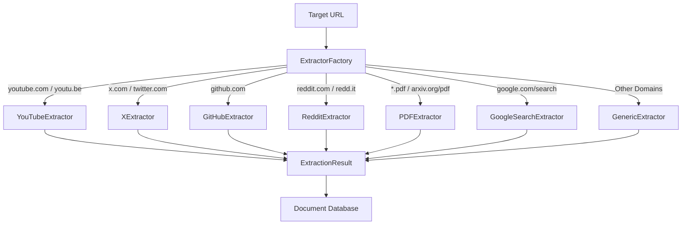

# Platform-Specific Content Extraction

This document explains the provider-based architecture for extracting platform-specific content (such as YouTube transcripts, GitHub READMEs, or Reddit comments) within the MindCache system.

---

## Overview

Traditional HTML parsers fail on modern, JavaScript-rendered platforms like YouTube and X (Twitter). Instead of scattering conditional domain checks throughout the document processor, MindCache uses a provider-based extraction pipeline that delegates processing to platform-specific classes.



---

## Architecture Components

The extraction system lives in the `app/services/extractors/` package and consists of these core components:

### 1. `ContentExtractor` (Base Class)

Abstract base class defined in `base.py` with one abstract method:

```python
async def extract(self, url: str) -> ExtractionResult
```

### 2. `ExtractionResult` (Dataclass)

Strongly-typed container carrying extracted content and metadata:

| Field | Type | Description |
|---|---|---|
| `content` | str | Clean extracted text (Markdown) |
| `title` | str | null | Page title |
| `author` | str | null | Author name |
| `published_date` | datetime | null | Publication date |
| `source_type` | str | Source identifier (Generic, YouTube, GitHub, Reddit, X, PDF) |
| `platform_metadata` | dict | Structured JSON metadata specific to the platform |
| `final_url` | str | null | Final URL after redirects |

### 3. `ExtractorFactory` (Factory Class)

Centralized registry in `factory.py` that maps URL domains to extractors. Resolution logic:

1. **PDF check**: URL ends with `.pdf`, or path contains `/pdf/` (arxiv, generic)
2. **Google Search check**: hostname is `google.com` and path starts with `/search`
3. **Direct domain lookup**: exact match in `_registry`
4. **Subdomain fallback**: strip `www.` or `m.` prefix from hostname
5. **Generic fallback**: `GenericExtractor` for all unmatched domains

```python
class ExtractorFactory:
    _registry = {
        "youtube.com": YouTubeExtractor(),
        "youtu.be": YouTubeExtractor(),
        "x.com": XExtractor(),
        "twitter.com": XExtractor(),
        "github.com": GitHubExtractor(),
        "reddit.com": RedditExtractor(),
        "old.reddit.com": RedditExtractor(),
        "redd.it": RedditExtractor(),
    }

    @classmethod
    def get_extractor(cls, url: str) -> ContentExtractor
```

### 4. Concrete Extractors

Seven platform-specific extractors plus one generic fallback.

---

## GenericExtractor

**Purpose**: Fallback extractor for standard websites. Uses Trafilatura as primary with BeautifulSoup4 structural extraction as fallback.

**Source file**: `generic.py`

**Extraction process**:
1. Downloads page HTML via HTTPX (with urllib fallback for TLS fingerprinting bypass)
2. Runs Trafilatura for main content + metadata extraction
3. If Trafilatura returns empty, runs `_fallback_extract()` — a custom BS4 extractor that:
   - Extracts title (from `<title>`, `og:title`, `twitter:title`)
   - Extracts meta description, keywords
   - Extracts all headings (h1-h6) as structural outline
   - Extracts JSON-LD schema data
   - Converts body content to Markdown (preserving headings, lists, code blocks, tables)
4. Constructs rich searchable content: Title + Meta Description + Keywords + Headings + Schema Data + Main Content

---

## YouTubeExtractor

**Purpose**: Extracts YouTube video metadata and transcripts.

**Source file**: `youtube.py`

**ID Extraction**: Handles all YouTube URL formats:
- `youtube.com/watch?v=VIDEO_ID`
- `youtu.be/VIDEO_ID`
- `youtube.com/embed/VIDEO_ID`
- `youtube.com/shorts/VIDEO_ID`
- `m.youtube.com/watch?v=VIDEO_ID`
- `youtube.com/live/VIDEO_ID`

**Extraction process**:
1. **Metadata**: Uses `yt-dlp` in skip-download mode (`yt_dlp.YoutubeDL({"format": "best", ...})`) to retrieve:
   - Title, channel, description, tags, categories
   - Duration, upload date, view count
2. **Transcript**: Uses `youtube-transcript-api` (`YouTubeTranscriptApi.get_transcript()`) to fetch captions
3. **Timestamp formatting**: Transcript segments are formatted with `[MM:SS]` timestamps every 30 seconds:
   ```
   [00:00] Welcome to this video
   [00:30] Today we'll discuss vector databases
   [01:00] FAISS is Meta's library for...
   ```
4. **Content assembly**: Title + Description + Transcript text (with timestamps)

**Fallback**: If transcript is disabled or missing (Shorts, long videos without captions):
- `extracted_content` = Title + Description + Tags
- `platform_metadata.transcript_available = false`
- Pipeline proceeds gracefully without errors

**Platform metadata**:
```json
{
    "video_id": "dQw4w9WgXcQ",
    "duration": 212,
    "channel": "Rick Astley",
    "tags": ["rickroll", "80s"],
    "transcript_available": true
}
```

**Source type**: `"YouTube"`

---

## XExtractor (Twitter)

**Purpose**: Extracts X/Twitter tweet content.

**Source file**: `x.py`

**Extraction process**:
1. Converts `x.com` or `twitter.com` URLs to `fixupx.com` (a public CDN syndication proxy)
2. Fetches HTML from the syndication URL
3. Extracts OpenGraph title and description from HTML meta tags

**Fallback**: If the syndication API fails (private tweet, deleted record, rate limits):
- Sets `partial_extraction = True`
- `extracted_content` uses basic URL parameters (Username, Tweet ID)
- Pipeline continues without crashing

**Platform metadata**:
```json
{
    "author": "Jack",
    "tweet_id": "20",
    "timestamp": "2006-03-21T20:50:14",
    "partial_extraction": false
}
```

**Source type**: `"X"`

---

## GitHubExtractor

**Purpose**: Extracts GitHub repository metadata and README content.

**Source file**: `github.py`

**URL Parsing**: Extracts owner and repo name from URL patterns:
- `github.com/owner/repo`
- `github.com/owner/repo/tree/branch` (uses owner/repo)
- `github.com/owner/repo/blob/branch/path` (uses owner/repo)

**Extraction process**:
1. Downloads repository page HTML via HTTPX
2. Extracts from HTML:
   - **Description**: Meta tags (`og:description`, `twitter:description`) and sidebar description
   - **Topics**: `.topic-tag` links (e.g., "python", "pdf", "rust")
   - **Stars**: Star count from the repo page
   - **README**: Content from `article.markdown-body` (rendered README HTML)
3. If README not found in page HTML, attempts to fetch raw README from `raw.githubusercontent.com`:
   - Tries `main` branch first, then `master` branch
   - Supports both `README.md` and `README.rst` extensions
4. Falls back gracefully if README is unavailable (partial extraction)

**Platform metadata**:
```json
{
    "owner": "karpathy",
    "repo_name": "micrograd",
    "description": "A tiny scalar-valued autograd engine",
    "topics": ["deep-learning", "autograd", "python"],
    "stars": 12345,
    "readme_available": true,
    "partial_extraction": false
}
```

**Source type**: `"GitHub"`

---

## RedditExtractor

**Purpose**: Extracts Reddit posts and comments.

**Source file**: `reddit.py`

**URL Handling**:
- Normalizes URLs to `old.reddit.com` (bypasses Cloudflare)
- Strips `.json` suffix if present
- Resolves `redd.it` short URLs via HTTP redirect

**Extraction process**:
1. Downloads page HTML from `old.reddit.com` via HTTPX
2. For **post pages**: Extracts title, subreddit, author, score, post content, and up to 10 top comments with scores
3. For **listing feeds**: Extracts post titles, URLs, and subreddits

**Fallback**: If HTTP request fails (network error, deleted content):
- Falls back to `GenericExtractor` for the URL

**Source type**: `"Reddit"`

---

## PDFExtractor

**Purpose**: Extracts PDF document content.

**Source file**: `pdf.py`

**Extraction process**:
1. Downloads PDF bytes via HTTPX (with urllib fallback)
2. Writes to a temporary file
3. Reads metadata + first page text via `pypdf` (in a thread to avoid blocking)
4. Converts full PDF to Markdown using `@pspdfkit/pdf-to-markdown` via `npx` (Node.js tool)
5. Cleans up temporary file

**Title extraction** (in order of priority):
1. PDF metadata title field (if not generic/filename-based)
2. First page text analysis (first 15 lines checked for title-like patterns)
3. Fallback to "PDF Document"

**Source type**: `"PDF"`

---

## GoogleSearchExtractor

**Purpose**: Extracts Google Search result pages.

**Source file**: `google_search.py`

**Extraction process**:
1. Parses the `q` query parameter from the URL
2. Attempts to download Google SERP HTML and extract `<h3>` result headings with URLs
3. If Google scraping fails or returns empty results, falls back to DuckDuckGo Search via `duckduckgo_search.DDGS.text()`

**Content**: Returns top 10 search results with titles, URLs, and snippets.

**Source type**: `"Generic"` (treated as generic content, knowledge score check applies)

---

## Factory Pattern and Extractor Registry

`ExtractorFactory` centralizes URL routing. This maintains a clean document processor that doesn't need to know which platform it is interacting with.

```python
# app/services/extractors/factory.py

class ExtractorFactory:
    _registry = {
        "youtube.com": YouTubeExtractor(),
        "youtu.be": YouTubeExtractor(),
        "x.com": XExtractor(),
        "twitter.com": XExtractor(),
        "github.com": GitHubExtractor(),
        "reddit.com": RedditExtractor(),
        "old.reddit.com": RedditExtractor(),
        "redd.it": RedditExtractor(),
    }

    @classmethod
    def get_extractor(cls, url: str) -> ContentExtractor:
        # 1. Check if PDF
        # 2. Check if Google Search
        # 3. Direct domain match
        # 4. Subdomain fallback
        # 5. GenericExtractor fallback
```

---

## Future Extension Process (Add a New Extractor)

To integrate a new platform (e.g., `Stack Overflow`):

### Step 1: Create the Extractor Class

Create a new file in `app/services/extractors/` (e.g. `stackoverflow.py`):

```python
# app/services/extractors/stackoverflow.py
from app.services.extractors.base import ContentExtractor, ExtractionResult

class StackOverflowExtractor(ContentExtractor):
    async def extract(self, url: str) -> ExtractionResult:
        # 1. Fetch Stack Overflow page HTML
        # 2. Extract title, question body, answers, tags
        # 3. Handle errors gracefully
        return ExtractionResult(
            content="Question and answer content...",
            title="How to use FAISS in Python?",
            author="user123",
            source_type="StackOverflow",
            platform_metadata={
                "tags": ["python", "faiss", "vector-search"],
                "score": 42,
                "answer_count": 3
            }
        )
```

### Step 2: Export from the Package

Add your class to the package interface file `app/services/extractors/__init__.py`:

```python
from app.services.extractors.stackoverflow import StackOverflowExtractor

__all__ = [
    # ...
    "StackOverflowExtractor"
]
```

### Step 3: Register the Domains in the Factory

Add the target hostnames to `ExtractorFactory._registry` inside `app/services/extractors/factory.py`:

```python
# app/services/extractors/factory.py
from app.services.extractors.stackoverflow import StackOverflowExtractor

class ExtractorFactory:
    _so_extractor = StackOverflowExtractor()

    _registry = {
        # Existing registrations...
        "stackoverflow.com": _so_extractor,
    }
```

### Step 4: Write Unit Tests

Add domain matching and parsing tests to `tests/test_extractors.py`:

```python
async def test_stackoverflow_extractor_success():
    extractor = StackOverflowExtractor()
    result = await extractor.extract("https://stackoverflow.com/questions/12345")
    assert result.source_type == "StackOverflow"
    assert result.title is not None
```

```bash
uv run pytest tests/test_extractors.py
```
