# MindCache: Search & Retrieval Study Guide

---

## The Pitch

### Developer Perspective

Imagine this. Three weeks ago you found the perfect GitHub repository. It solved exactly the problem you're facing today. You remember reading it. You remember it had something to do with AI. You remember it was on GitHub. But that's it.

Now you spend 30 minutes searching:

- Browser history
- Google
- GitHub
- Bookmarks
- Open tabs

And eventually give up. The information wasn't lost — your memory of it was. Every day we consume hundreds of pages, videos, posts, repositories, tutorials, and discussions. The internet remembers everything. Our browsers remember URLs. But neither remembers what was actually useful to us.

MindCache solves that problem.

Instead of remembering where you found something, you simply describe what you remember. "That Rust PDF parser." "That repo about stopping AI slop." "The YouTube video explaining FAISS."

MindCache finds it instantly.

Not by matching URLs. Not by matching titles. By understanding what you actually mean.

### End-User Perspective

Every day we consume an enormous amount of information. We read articles, watch videos, browse websites, open documents, and search for answers. But a few days later, when we need that information again, we often cannot find it. We remember learning it. We remember it was useful. We may even remember a few details about it. But we don't remember where it came from.

As a result, we waste time searching through browser history, bookmarks, tabs, notes, search engines, and messages trying to rediscover something we have already seen before. The problem is not that information is unavailable. The problem is that our digital tools remember locations, while humans remember ideas.

- Browser history remembers URLs.
- Bookmarks remember links.
- People remember concepts.

MindCache bridges that gap.

Instead of searching for where something was, users simply describe what they remember — a topic, a phrase, a question, an idea. MindCache searches through previously visited content, understands the meaning behind the query, and brings back the information that matters. It transforms passive browsing history into an intelligent personal memory system.

---

## Core Concepts

### 1. How Search Engines Work

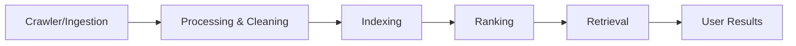

A search engine follows a systematic pipeline: discover data, clean it, index it, rank it, and retrieve it. It starts with a crawler or ingestion layer that collects raw data, a processing layer that structures and cleans it, an indexing layer that builds fast lookup structures, and a retrieval layer that returns the most relevant documents sorted by a ranking algorithm.

Think of a library catalog system. When a new book arrives, the librarian records its title and topics (ingestion), stores it on the correct shelf (indexing), and helps visitors find books by sorting by popularity or match (retrieval/ranking). Without this pipeline, finding a book in a library of millions would be impossible.

**Real-world examples:** Google Search, Bing, Elasticsearch, and e-commerce product catalogs.

**How we use it in MindCache:** Webpages visited in the browser are captured by the browser extension, sent to the FastAPI backend via the `/visit` endpoint defined in `backend/app/api/visit.py`, cleaned of noise, processed for keywords and entities, indexed locally into both FAISS (vector) and BM25 (lexical) indices, and finally searched through a hybrid ranking algorithm that fuses semantic and lexical signals.

---

### 2. Databases (SQLite Basics)

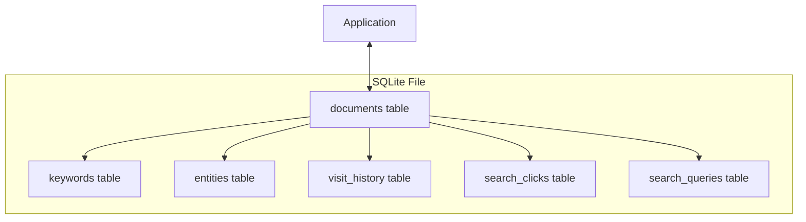

A database is a structured storage system. SQLite is a serverless, self-contained, zero-configuration relational database engine stored in a single local file. Unlike client-server databases (PostgreSQL, MySQL), SQLite runs in-process with your application — there is no separate database process to install, configure, or manage.

The entire database lives in one `.db` file on disk. Tables store structured rows and columns. Relationships between tables are expressed via foreign keys (e.g., a keyword record points to the document it belongs to). Queries are written in SQL — the lingua franca of relational databases.

```sql
CREATE TABLE search_queries (
    id INTEGER PRIMARY KEY,
    query TEXT NOT NULL,
    timestamp DATETIME DEFAULT CURRENT_TIMESTAMP
);

INSERT INTO search_queries (query) VALUES ('rag architecture');
```

**Why SQLite?** It is embedded in practically every browser, mobile app, and desktop application. Zero setup, zero maintenance, zero network overhead. For a single-user local application like MindCache, it is the ideal storage engine.

**How we use it in MindCache:** MindCache stores all relational metadata — documents, visit history, keywords, extracted entities, search queries, and search clicks — in `data/mindcache.db` using SQLAlchemy ORM models defined in `backend/app/models/document.py`. The async SQLAlchemy session management is handled in `backend/app/db/session.py`. The schemas defining the API contract are in `backend/app/schemas/document.py`.

---

### 3. REST APIs

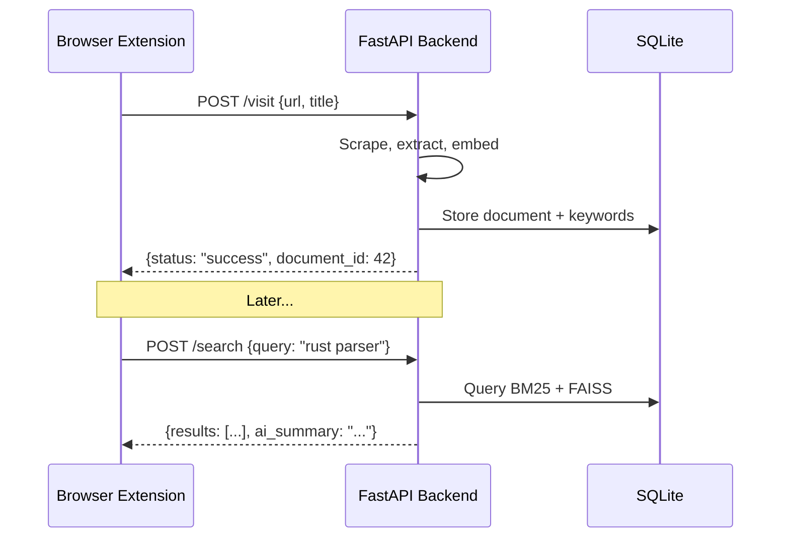

REST (Representational State Transfer) APIs communicate over standard HTTP protocols. Clients send requests — GET to retrieve data, POST to create, DELETE to remove — with parameters or JSON body payloads, and servers return structured responses, typically in JSON format.

The key ideas: statelessness (each request contains all the information the server needs), resource-based URLs (`/documents/42`), and standard HTTP methods (GET, POST, PUT, DELETE).

```json
{
    "url": "https://github.com/karpathy/micrograd",
    "title": "karpathy/micrograd"
}
```

**How we use it in MindCache:** The FastAPI backend exposes REST endpoints that the browser extension calls to transmit data. The primary routes are:

- `POST /visit` in `backend/app/api/visit.py` — ingests a URL for processing
- `POST /search` and `POST /search/click` in `backend/app/api/search.py` — performs semantic search and records click feedback
- `GET /documents`, `GET /documents/{id}`, `DELETE /documents/{id}`, `POST /documents/{id}/summarize` in `backend/app/api/documents.py` — CRUD and summarization
- `GET /graph` in `backend/app/api/documents.py` — knowledge graph data
- `GET /health` in `backend/app/api/health.py` — live diagnostics across all system components

The backend client abstraction in `extension/src/services/BackendClient.ts` wraps these endpoints with retry logic, response validation, and error handling.

---

### 4. Web Scraping & HTML Extraction

Web scraping extracts clean, structured text content from raw, noisy HTML markup. The challenge is not fetching the HTML — it is discarding everything that is not actual content: navigation bars, ads, sidebars, cookie popups, scripts, and styles.

```python
from bs4 import BeautifulSoup

html = "<html><body><nav>Home</nav><main><p>Core text here.</p></main></body></html>"
soup = BeautifulSoup(html, "html.parser")
clean_text = soup.find("main").text  # "Core text here."
```

A good extraction pipeline:

1. Fetches the raw HTML (handling redirects, timeouts, and bot detection)
2. Parses the DOM tree
3. Identifies and removes non-content elements (scripts, styles, nav, footer, iframes)
4. Extracts the remaining text in a structured order (headings, paragraphs, lists, code blocks, tables)
5. Cleans whitespace and encoding

**How we use it in MindCache:** MindCache uses a two-tier extraction strategy in `backend/app/services/document_processor.py`. The primary extractor is `trafilatura` — a purpose-built Python library for web text extraction. When trafilatura fails (or for specific platforms), the system falls back to a custom BeautifulSoup extractor that does structural extraction: it preserves heading hierarchy as markdown headers, converts lists and tables to clean text, and extracts meta descriptions as contextual preamble. The download layer uses `httpx` with a standard browser User-Agent, falling back to `urllib` to bypass TLS fingerprinting on platforms like Medium that block headless HTTP clients.

Additionally, the extension's content script performs **client-side extraction** using Defuddle (the same library used by Obsidian Web Clipper). This enables indexing of pages behind authentication, JavaScript-rendered SPAs, and reduces server load.

---

### 5. Text Processing

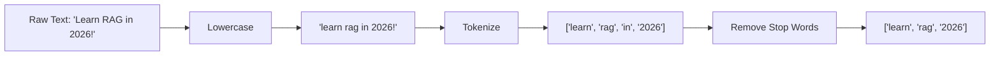

Text processing is the foundation of all text-based machine learning. Raw text must be cleaned and normalized before any algorithm can work with it. The standard pipeline:

1. **Lowercasing** — converts everything to lowercase so "RAG" and "rag" match
2. **Punctuation removal** — strips punctuation marks that carry no semantic signal
3. **Tokenization** — splits text into individual terms (tokens)
4. **Stop word removal** — filters out common words like "the", "is", "a" that appear in every document and carry little discriminative power

```python
import re
raw_text = "Learn RAG in 2026!"
tokens = re.findall(r"\b\w+\b", raw_text.lower())
# tokens = ["learn", "rag", "in", "2026"]
```

**Why it matters without ML:** Even before vectors and neural networks, text processing enabled spam filtering (counting words like "free" and "winner"), sentiment analysis (counting positive vs. negative words), and search indexing (building inverted lists of which documents contain which words).

**How we use it in MindCache:** Tokenization with split-hyphen support is implemented in `backend/app/services/bm25_service.py` to handle compound query terms like "state-of-the-art" or "stop-slop". All text ingested into the BM25 index goes through this normalization pipeline before token frequency scoring. The search service uses a comprehensive 120+ stopword list in `_extract_query_keywords()` to filter significant terms from short queries.

---

### 6. TF-IDF (Term Frequency - Inverse Document Frequency)

TF-IDF is a statistical measure that reflects how important a word is to a document within a collection (corpus). It combines two intuitions:

- **Term Frequency (TF):** Words that appear many times in a document are likely important to that document's topic.
- **Inverse Document Frequency (IDF):** Words that appear in many documents across the corpus are less discriminative and should be downweighted.

$$\text{TF-IDF}(t, d) = \text{TF}(t, d) \times \log{\frac{N}{\text{DF}(t)}}$$

Where:
- $t$ = term, $d$ = document
- $N$ = total number of documents
- $\text{DF}(t)$ = number of documents containing term $t$

**Concrete example:** In a dataset of 100 coding articles, the word "the" appears in all 100 (high DF, low IDF). The word "PyTorch" appears in only 2 (low DF, high IDF). An article that mentions "PyTorch" frequently will rank highly for a "PyTorch" search query.

**Why TF-IDF over raw word counts:** Raw word counts unfairly favor long documents (they simply have more words). IDF normalizes across the corpus. A word that is rare across all documents gets a higher weight when it does appear.

**How we use it in MindCache:** TF-IDF is used as a lightweight fallback keyword extractor in `backend/app/services/keyword_extractor.py`. When the local Ollama LLM is unavailable (offline or model missing), the system falls back to scikit-learn's `TfidfVectorizer` to extract top keywords purely from term frequency statistics, ensuring keyword extraction still works even without AI.

---

### 7. BM25 (Best Matching 25)

BM25 is a state-of-the-art probabilistic ranking function that evolved from TF-IDF. It introduces two critical improvements:

1. **Term frequency saturation** — mentioning a word 5 times is significantly more meaningful than mentioning it once. But mentioning it 50 times is not 10x more meaningful than 5 times. BM25 applies a saturation curve so that excessive repetition does not inflate the score.

2. **Document length normalization** — longer documents naturally have higher word frequencies. BM25 penalizes overly wordy documents so a concise article that uses a keyword once might outrank a verbose article that uses it many times.

$$ \text{BM25}(t, d) = \text{IDF}(t) \cdot \frac{\text{TF}(t, d) \cdot (k_1 + 1)}{\text{TF}(t, d) + k_1 \cdot (1 - b + b \cdot \frac{|d|}{\text{avgdl}})} $$

Where $k_1$ and $b$ are tuning parameters controlling saturation strength and length normalization.

**Concrete example:** If a document mentions "python" 5 times, mentioning it a 6th time does not increase its BM25 score nearly as much as the jump from 0 to 1 mention. And a 200-word article mentioning "python" once may outrank a 5000-word article mentioning it three times.

**Real-world adoption:** BM25 is the core ranking algorithm in Elasticsearch, Apache Solr, and countless production search systems. It represents the ceiling of what classical (pre-neural) keyword search can achieve.

**How we use it in MindCache:** Encapsulated in `backend/app/services/bm25_service.py` using the `rank-bm25` Python package (BM25Okapi variant). BM25 generates lexical candidate matches during hybrid queries. It is particularly effective for matching specific terms like library names (`pandas`, `react`), code syntax (`Rust`, `async/await`), and brand names (`OpenAI`) that vector search may miss.

**Customizations:**
- **Stemming**: A minimal suffix-stripping stemmer handles 15+ suffixes (`ization`, `ational`, `fulness`, `tion`, `ment`, `ness`, `ing`, `ed`, `s`, `ly`, `able`, `ible`, `al`, `ial`, `ual`)
- **Hyphen splitting**: Compound terms like "state-of-the-art" are split into individual tokens
- **Metadata weighting**: BM25 corpus entries include repetition-weighted metadata (repo_name ×5, description ×3, topics ×3, title ×3, keywords ×2) to boost important identifiers

---

### 8. Embeddings

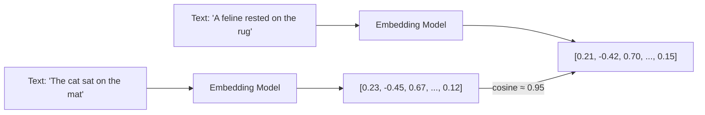

Embeddings are mathematical representations of data translated into lists of numbers (vectors) in a continuous space. They transform complex data — text, images, audio — into simple, dense vector representations where items with similar meanings or traits are placed close together.

Computers operate on math, but humans use unstructured data like text, images, and audio. Embeddings translate unstructured human language and visuals into mathematical spaces AI models can process.

One of the main use cases for embeddings is in RAG (Retrieval-Augmented Generation) systems, where the model uses embeddings to retrieve relevant documents or content from a knowledge base before generating a response. Unlike traditional search engines which mostly rely on exact keyword matches, embedding models map search queries and documents into the same vector space, allowing AI to match the _meaning_ of a search rather than just the exact words.

Another major application is recommendation systems — platforms like streaming services or e-commerce sites use embeddings to understand what users like. By comparing the vector of a product you previously bought to vectors of other products, the system recommends items that fit your "taste space."

**How we use it in MindCache:** MindCache calls the local Ollama embeddings API (running models like `embeddinggemma:300m` producing 768-dimensional vectors) in `backend/app/services/embedding_service.py` to generate dense vector representations of document chunks. Embeddings are generated in batches, cached for repeated queries (FIFO cache, 512 entries), and stored in the FAISS index for fast similarity search.

---

### 9. Cosine Similarity

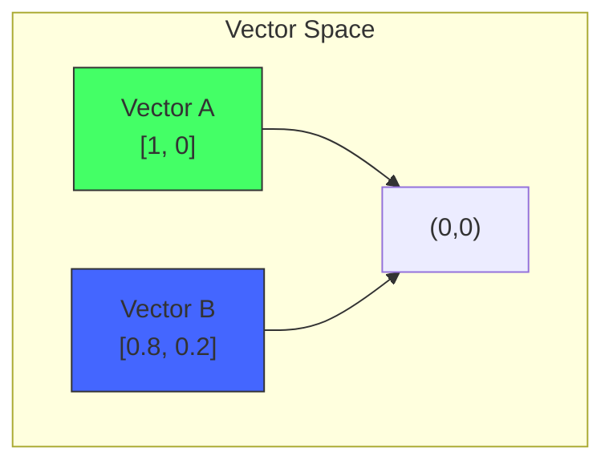

Cosine similarity measures how similar two vectors are regardless of their magnitude (length). It calculates the cosine of the angle between them:

$$\text{similarity} = \frac{\mathbf{A} \cdot \mathbf{B}}{\|\mathbf{A}\| \|\mathbf{B}\|}$$

A score of $1$ means the vectors point in the exact same direction, $0$ means they are completely unrelated (orthogonal), and $-1$ means they point in opposite directions. For text embeddings, scores typically fall between $0$ and $1$, since embeddings from most models occupy only the positive quadrant of the vector space.

**Why ignore magnitude?** When comparing documents using word counts, longer documents will naturally have higher word frequencies. Cosine similarity allows you to compare documents of entirely different sizes by evaluating only whether they talk about the same concepts, regardless of how much they say about them.

**How we use it in MindCache:** Vectors are L2-normalized before being added to the FAISS index. This means the inner product (dot product) between normalized vectors equals the cosine similarity. The FAISS search in `backend/app/services/vector_service.py` uses `IndexFlatIP` (Inner Product) on normalized vectors, which is mathematically equivalent to cosine similarity.

---

### 10. Vector Search

Vector search is a way of finding things that are similar in meaning, not just in words. It works by turning data — text, images, or videos — into numbers called vectors that represent the _meaning_ of the content. Instead of matching exact keywords, vector search finds things that are related or similar in context.

**Traditional search vs. Vector search:**

| Aspect | Traditional (BM25/Keyword) | Vector Search |
|---|---|---|
| **Match basis** | Exact word overlap | Semantic meaning |
| **Query "car" matches** | Documents with "car" | Documents about "vehicle", "automobile", "transport" |
| **Handling synonyms** | Fails (needs manual synonym lists) | Works naturally |
| **Language understanding** | None | Full contextual understanding |

**How vector search works in practice:**

1. All documents are passed through an embedding model to produce vectors
2. The user's query is passed through the _same_ embedding model to produce a query vector
3. The query vector is compared against all document vectors using a similarity metric (typically cosine similarity)
4. The top $K$ most similar documents are returned

The fundamental constraint: both queries and documents must be embedded by the same model to share the same vector space.

**How we use it in MindCache:** Query vectors are searched against chunk vectors in the FAISS index to find the top $K$ semantically matching document chunks. The actual search call is in `backend/app/services/vector_service.py` in the `search_similar()` method, which handles normalization, search, and result extraction. MindCache uses exact search (Flat index) rather than approximate (IVF, HNSW) since the dataset size is desktop-scale (thousands to low millions of vectors).

---

### 11. FAISS (Facebook AI Similarity Search)

FAISS is an open-source library developed by Meta for efficient similarity search and clustering of dense vectors. It is designed to ingest high-dimensional vectors and calculate which ones are mathematically closest to each other using metrics like Euclidean distance (L2) or cosine similarity.

**Why FAISS exists:** Traditional search engines (like SQL or Elasticsearch) rely on exact keyword matching, which fails when dealing with the underlying meaning of complex data. In modern AI, data is converted into high-dimensional numerical representations called embeddings (vectors). But searching through millions of vectors exhaustively (comparing every query against every document) is computationally infeasible at scale.

FAISS solves this with:
- **Index structures** — data structures that organize vectors for fast approximate search (e.g., IVF, HNSW, PQ)
- **GPU acceleration** — for even faster search on compatible hardware
- **Batch processing** — efficient search across multiple queries simultaneously
- **ID mapping** — associating custom identifiers (like database primary keys) with vectors

**What FAISS is NOT:** FAISS is not a full-fledged database. It does not natively handle data storage, complex metadata filtering, or user access management. Developers typically store raw data and metadata in traditional databases and use FAISS solely as an in-memory or on-disk index for fast vector searching.

**How we use it in MindCache:** MindCache uses FAISS in `backend/app/services/vector_service.py` to manage its vector store locally at `data/faiss_index.bin`. The index uses `IndexIDMap` wrapping `IndexFlatIP` (Inner Product) on L2-normalized vectors. This configuration gives exact cosine similarity search — not approximate — which is appropriate for MindCache's desktop-scale dataset (thousands to low millions of vectors). The index is persisted to disk and loaded on server startup, with automatic dimension-mismatch detection and re-indexing if the embedding model changes.

---

### 12. Hybrid Search

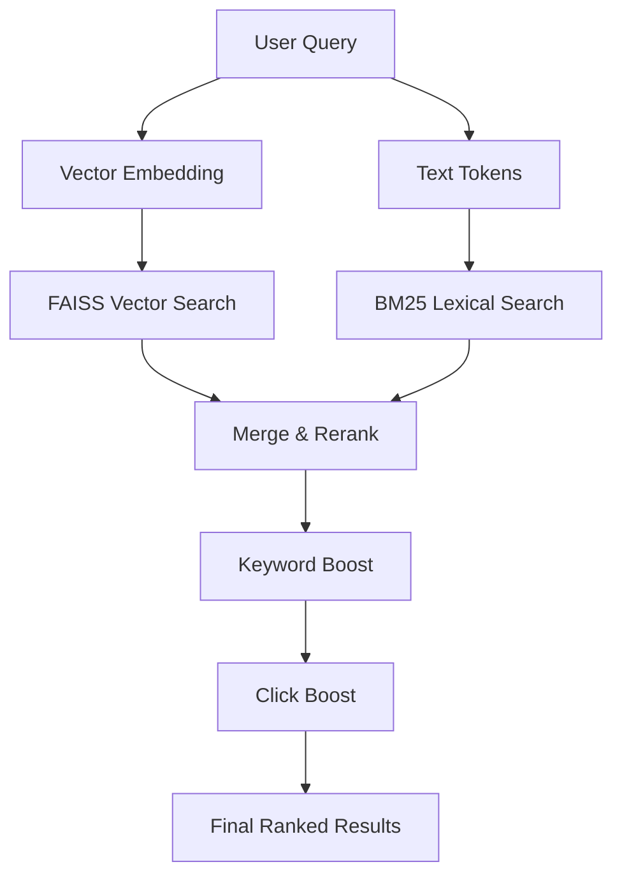

Hybrid search combines lexical search (BM25 — exact term matching) with semantic search (FAISS — conceptual matching) to get the best of both worlds.

**Why hybrid?** Vector search excels at finding conceptually related documents. It will match "How do I parse JSON in Python?" to a document about "Python `json` module API reference" even if they share zero exact words. But vector search can miss specific, rare, or compound terms like a library name (`pandas`), a version number (`v3.12`), a code snippet (`await async_fn()`), or a compound identifier (`CVE-2026-98`). Lexical search catches these perfectly.

Conversely, BM25 is great at exact matches but will miss documents that use synonyms or rephrased concepts. Together, they cover each other's blind spots.

**How we use it in MindCache:** The search pipeline in `backend/app/services/search_service.py` executes both searches in parallel, then scores each candidate document with a weighted fusion formula:

1. **FAISS** retrieves top 30 candidates by vector similarity
2. **BM25** retrieves top 40 candidates by lexical match (using expanded query with concept alternatives)
3. **Keyword search** adds keyword-matched documents from SQLite
4. **Merge & rerank**: each candidate gets a final score computed from 7 weighted signals:

$$\text{score} = 0.45 \cdot V_{\text{score}} + 0.25 \cdot B_{\text{score}} + 0.10 \cdot T_{\text{score}} + 0.05 \cdot K_{\text{score}} + 0.05 \cdot M_{\text{score}} + 0.02 \cdot R_{\text{score}} + 0.03 \cdot S_{\text{score}}$$

Where:
- **V** = FAISS vector cosine similarity
- **B** = BM25 lexical score
- **T** = Title keyword overlap
- **K** = Ingested keyword matches
- **M** = Platform metadata matches (repo name, topics, etc.)
- **R** = Recency decay (30-day half-life)
- **S** = Source type boost (GitHub=1.0, YouTube/Reddit/X=0.5)

5. **Quality multiplier**: score × (1 + quality_score × 0.05) — promotes high-quality pages
6. **Click feedback**: +0.10 per click (capped at +0.30) from `/search/click`
7. **YouTube timestamp matching**: finds segment timestamps within video transcripts
8. **Score floor**: results below 0.15 are filtered out

---

### 13. Metadata Engineering

Metadata engineering is the practice of appending structured contextual information directly to text chunks before embedding or indexing. It is not about storing metadata in a separate column — it is about weaving metadata _into_ the vector representation itself.

**The problem:** A vector embedding of raw text like "Star 45,200 | A Rust-based PDF parser" contains no information about what "Star" means or that the repository has 45,200 GitHub stars. The embedding model treats it as arbitrary tokens.

**The solution:** Prepend structured context to each chunk:

```
Title: lopdf
Domain: github.com
Source Type: GitHub
Keywords: pdf, rust, parser, document
Entities: lopdf:Project
Metadata: Stars: 5200 | Topics: pdf, rust, parser

Content (Chunk 1/3):
lopdf is a Rust library for PDF document manipulation...
```

Now the embedding model sees the metadata as text woven into the chunk, and the vector encodes the relevance signals directly. A search for "popular Rust PDF library" will match because the vector has been influenced by "Stars: 5200" and "Rust" in the metadata prefix.

**How we use it in MindCache:** MindCache extracts platform-specific metadata in specialized extractors:
- `backend/app/services/extractors/github.py` — stars, topics, language
- `backend/app/services/extractors/youtube.py` — channel, views, duration
- `backend/app/services/extractors/reddit.py` — subreddit, score, comments

This metadata is injected into every chunk before vector generation in `backend/app/services/document_processor.py`. The BM25 index also uses metadata repetition weighting (repo_name ×5, topics ×3, etc.) to boost important identifiers in lexical search.

---

### 14. Chunking

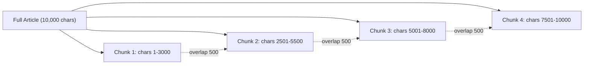

Chunking is the process of splitting long texts into smaller, manageable passages before embedding. It is necessary because:

1. **Embedding model context limits** — most embedding models have a maximum input size (e.g., 512 tokens for BERT-based models). Text beyond this limit is silently truncated, losing semantic information.

2. **Search granularity** — a single vector for a 50-page document is too coarse. If the user searches for something mentioned on page 37, a single document-level vector provides no positional signal. Chunk-level vectors let search pinpoint the exact passage.

3. **Semantic focus** — shorter chunks have more focused semantic content. A chunk about "error handling" will produce a cleaner vector than a 10,000-word document covering introduction, installation, API reference, and troubleshooting.

Overlapping chunks ensure that sentences or concepts split across chunk boundaries are preserved entirely in at least one chunk.

**How we use it in MindCache:** Performed in `backend/app/services/document_processor.py`. Documents are split into chunks of 3000 characters with 500-character overlap (up to a max of 40000 characters total). Each chunk is prepended with rich metadata (title, domain, source type, keywords, entities, platform metadata) before being embedded individually. All chunks from the same document share the same database ID, enabling document-level deduplication during search — FAISS returns `document_id` with each chunk vector, and search results are grouped by document.

---

### 15. BERT (Bidirectional Encoder Representations from Transformers)

BERT, developed by Google, is a transformer-based model that revolutionized Natural Language Processing (NLP) by understanding words based on their full context — looking at both the preceding and succeeding words simultaneously rather than sequentially.

**Before BERT:** Earlier language models (like GPT-1 and ELMo) read text in one direction — left-to-right or right-to-left. This meant the representation of a word could only incorporate context from one side. BERT introduced bidirectional attention, allowing each word to attend to every other word in the sentence at every layer of the model.

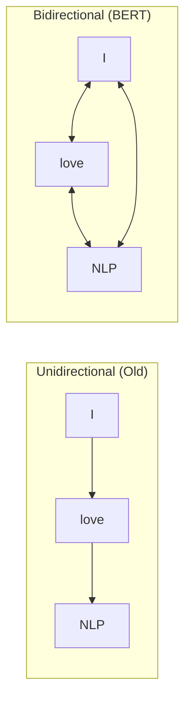

**How BERT is trained:**

BERT learned language through two unsupervised pre-training tasks:

1. **Masked Language Modeling (MLM):** 15% of the words in a sentence are randomly hidden (masked). The model must predict the missing word using the surrounding context from both sides.
   > "The [MASK] sat on the mat" → "The **cat** sat on the mat"

2. **Next Sentence Prediction (NSP):** The model is given two sentences and must predict whether the second sentence logically follows the first.
   > "I bought a new GPU. It has 24GB of VRAM." → **Follows** (True)
   > "I bought a new GPU. The capital of France is Paris." → **Does not follow** (False)

**How we use it in MindCache:** While MindCache does not directly load or run a BERT model in Python, the embedding models served by Ollama (like `embeddinggemma:300m`) are built on the same transformer architecture that BERT pioneered. The bidirectional context encoding that BERT introduced is the foundation upon which all modern embedding models are built. For users who prefer to use traditional BERT-family models, the embedding service can be configured to call any Ollama-hosted embedding model.

---

### 16. DistilBERT

DistilBERT is a compact, fast, and lightweight Transformer model developed by Hugging Face. It retains about 97% of BERT's language understanding capabilities while being 40% smaller and running 2 to 3 times faster.

**How it works — Knowledge Distillation:**

DistilBERT was created using _knowledge distillation_. The large BERT model acts as the "teacher" while DistilBERT acts as the "student." Instead of learning from raw labeled data, the student is trained to replicate the output distributions and hidden states of the teacher.

The compression comes from:
- **Fewer layers:** Transformer layers reduced from 12 to 6 (half)
- **Removed token-type embeddings:** The segment embeddings used for NSP are dropped
- **No NSP objective:** The student only trains on the MLM task

**Parameter count:** 110 million (BERT) → 66 million (DistilBERT)
**Speed gain:** 2-3x faster inference with ~97% of the original performance on most NLP benchmarks.

**How we use it in MindCache:** DistilBERT represents the class of efficient models that MindCache's design philosophy aligns with. The project deliberately avoids loading heavy Hugging Face models in the Python backend process (which would consume 1GB+ of RAM). Instead, it offloads embedding generation to Ollama, which uses optimized C++ inference (llama.cpp) with dynamic GPU/CPU offloading — the same efficiency-first approach that models like DistilBERT exemplify.

---

## Advanced Concepts

### 1. Information Retrieval (IR)

Information Retrieval is the academic and engineering discipline of organizing, storing, searching, and managing unstructured information — primarily text documents. It encompasses everything from inverted indices (mapping words to the documents they appear in) to dense vector spaces and probabilistic ranking models.

**The core problem:** Given a collection of documents and a user's information need expressed as a query, return the documents most likely to satisfy that need, ranked by relevance.

**Key IR structures:**
- **Inverted index:** Maps each unique term to the list of documents containing it. Enables instant boolean and ranked retrieval.
- **Postings list:** The list of document IDs for a given term, often compressed and stored sequentially.
- **Vector space model:** Represents documents and queries as vectors in a high-dimensional space where each dimension corresponds to a term.

**How we use it in MindCache:** The backend retrieval architecture is a standalone, single-user local IR engine integrating:
- A relational database (SQLite) for document metadata and relationships (6 tables: documents, keywords, entities, visit_history, search_clicks, search_queries)
- A dense vector index (FAISS) for semantic retrieval
- A sparse lexical index (BM25) for keyword retrieval
- A metadata-aware chunking strategy that blends structured fields into the vector representation

---

### 2. Search Metrics

Search metrics are quantitative measurements used to evaluate the relevance and quality of search results. Without metrics, improving a search engine is guesswork.

**Core metrics:**

- **Precision:** The fraction of retrieved documents that are relevant.
  $$\text{Precision} = \frac{|\text{Relevant} \cap \text{Retrieved}|}{|\text{Retrieved}|}$$

- **Recall:** The fraction of all relevant documents that were successfully retrieved.
  $$\text{Recall} = \frac{|\text{Relevant} \cap \text{Retrieved}|}{|\text{Relevant}|}$$

- **Precision@K / Recall@K:** Precision or recall calculated on only the top $K$ results. In practice, users rarely look beyond the first page, so metrics at low $K$ (1, 5, 10) matter most.

- **MRR (Mean Reciprocal Rank):** Evaluates where the first relevant document appears in the results list.
  $$\text{MRR} = \frac{1}{N} \sum_{i=1}^{N} \frac{1}{\text{rank}_i}$$

If a search returns 5 documents and the 2nd document is the target, the Reciprocal Rank is $1/2 = 0.5$.

**How we use it in MindCache:** A regression search evaluation suite in `tests/test_api.py` reads `tests/search_evaluation.json` and executes test queries. The suite asserts that expected documents consistently rank at position #1 (MRR = 1.0), providing a regression safety net for ranking algorithm changes. The evaluation queries include:
- "stop ai slop" → expects "stop-slop"
- "karpathy coding rules" → expects "karpathy-guidelines"
- "fastapi web framework" → expects "FastAPI Web Server"
- "rust programming language" → expects "Rust Programming"

---

### 3. Reranking

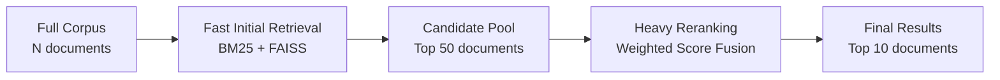

Reranking is a two-stage retrieval strategy. The first stage uses a fast, cheap algorithm to retrieve a broad pool of candidate documents. The second stage re-evaluates and re-sorts that smaller pool using more expensive but more accurate scoring methods.

**Why two stages?** Running a heavy cross-encoder neural model or a complex multi-factor scoring formula on the entire corpus is impractical. But running it on 50 carefully selected candidates is fast and drastically improves final result quality.

**How we use it in MindCache:** The search pipeline in `backend/app/services/search_service.py` implements this pattern:

1. **First stage:** FAISS retrieves the top 30 candidates by vector similarity; BM25 retrieves another 40 by lexical match; keyword matches add more
2. **Merge phase:** All candidates are merged into a single pool
3. **Rerank phase:** Each candidate gets a final score computed from 7 weighted signals (vector score, BM25 score, title overlap, keyword overlap, metadata overlap, recency, source type), plus a quality multiplier and click-boost bonus

The rerank pool size is flexible but large enough to ensure diverse candidates.

---

### 4. RAG (Retrieval-Augmented Generation)

RAG is a technique that supplies documents retrieved from an index as context directly inside an LLM's prompt. This allows the model to generate grounded, factually correct answers without relying solely on its training data — eliminating the primary source of LLM hallucinations.

**The core idea:** Instead of asking "What are Karpathy's coding rules?" to a model that must answer from memory, you first retrieve the relevant document snippets, then construct a prompt like:

> **Context:** Andrej Karpathy's guidelines include writing clean code, preferring simplicity over optimization, and documenting design decisions.
>
> **Question:** What are Karpathy's coding rules?
>
> **Answer:**

The LLM now has the exact facts in its context window. It does not need to remember or hallucinate — it just needs to read and synthesize.

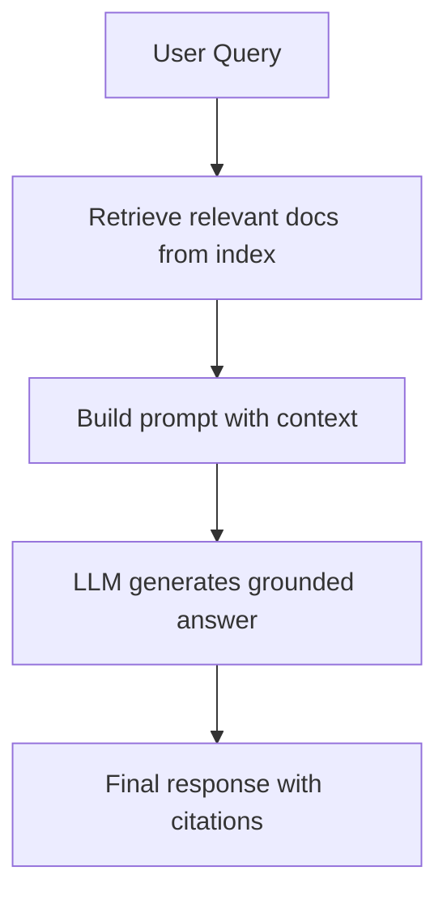

**How we use it in MindCache:** MindCache runs local RAG entirely offline. When the user enables AI summaries during search, the `backend/app/services/search_service.py` pipeline gathers the top matching document snippets, formats them into a synthesis prompt, and calls `qwen3.5:2b` via Ollama (handled in `backend/app/services/ollama_service.py` `generate_collective_summary()`). The prompt instructs the model to cite sources by number `[1]`, avoid introductory boilerplate, and synthesize findings into cohesive paragraphs with max 2 sentences per document.

---

### 5. Entity Extraction

Named Entity Recognition (NER) is the task of identifying and classifying key nouns in unstructured text into predefined categories — typically Person, Organization, Location, Technology, and Product.

**Example:**
> "I read about PyTorch on Google."
> → `{"PyTorch": "Technology", "Google": "Company"}`

Entity extraction enables powerful downstream features:
- **Automatic tagging:** Documents are automatically tagged with the entities they mention
- **Relationship graphs:** Entities appearing in the same document are linked by co-occurrence
- **Faceted search:** Users can filter search results by entity type or name

**How we use it in MindCache:** Managed in `backend/app/services/entity_extractor.py`. The primary extraction path uses Ollama (`qwen3.5:2b`) to identify entities (max 8), with a regex-based fallback that looks for capitalized proper nouns matching known patterns (Person: two capitalized words, Technology: technical terms, Company: corporate suffixes). Extracted entities are stored in the SQLite `entities` table linked to their document, and their names are prepended to each chunk's embedding text via the metadata prefix. Entities also power the knowledge graph visualization by forming co-occurrence edges between entities that appear in the same document.

---

### 6. Learning to Rank (Click Boosting)

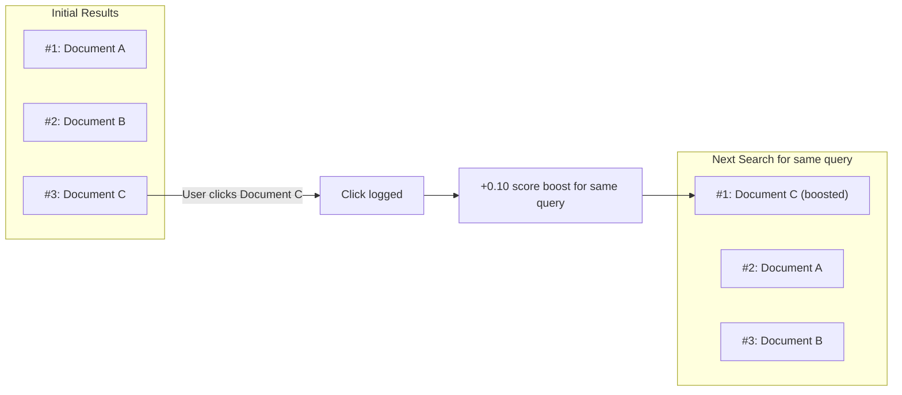

Learning to Rank (LTR) optimizes result ordering by leveraging historical user interaction data. The simplest and most effective form is click boosting: if users consistently click on a specific result for a given query, that result should rank higher in future searches for the same query.

**Why it works:** User clicks are implicit relevance judgments. If a user searches "slop", skips results #1 and #2, and clicks result #3, that is strong evidence that result #3 is the most relevant, even if the ranking algorithm disagrees. Over time, click feedback adapts the ranking to real user preferences.

**How we use it in MindCache:** MindCache logs search clicks via `POST /search/click` in `backend/app/api/search.py` to a `search_clicks` table in SQLite. During retrieval, the `search_service` loads click counts for the current query (case-insensitive) and applies a score boost of +0.10 per click, capped at +0.30. This means a document that has been clicked 3+ times for the same query gets a significant ranking elevation. The system is entirely local and privacy-preserving — no click data ever leaves the machine.

---

## Expert Concepts

### 1. Knowledge Graphs

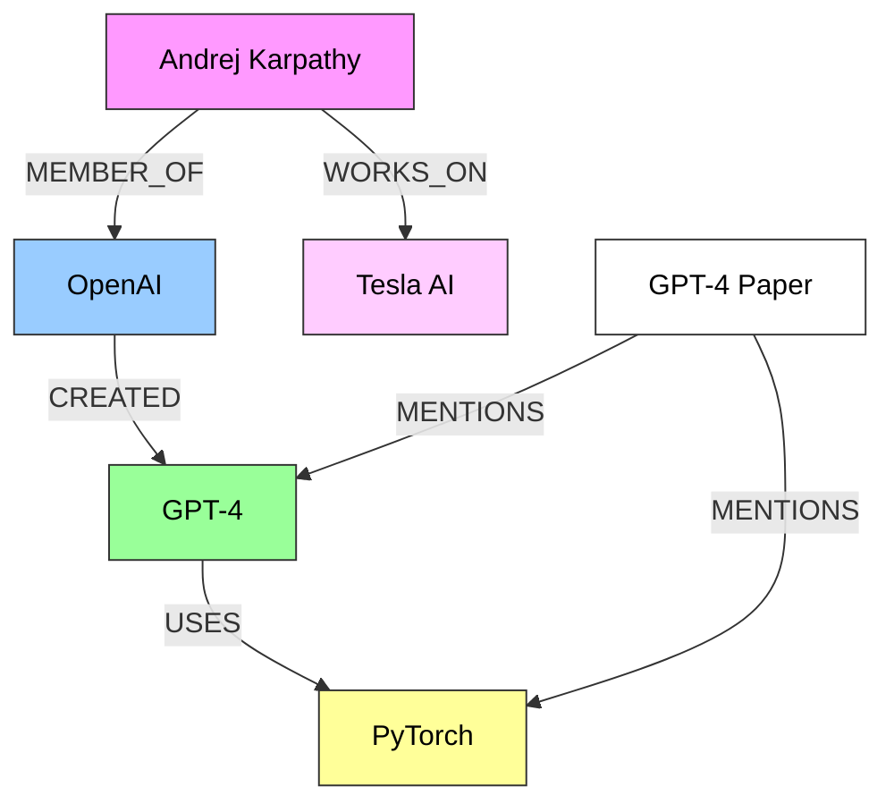

A knowledge graph stores information as structured networks of entities (nodes) connected by semantic relationships (edges). Unlike a flat table or document, a knowledge graph captures _connections between things_ — who works at which company, what technologies a project uses, which people are mentioned together in an article.

In MindCache's context, the knowledge graph has three node types:

- **Documents** — the web pages you visited
- **Keywords** — topics extracted from those pages
- **Entities** — named things: People, Companies, Technologies, Projects

Edges represent relationships: a document "has keyword" a topic; a document "has entity" a person; two entities "co-occur" in the same document.

**How we use it in MindCache:** The `/graph` endpoint in `backend/app/api/documents.py` builds the entire graph dynamically from the SQLite database. It aggregates all documents, entities, and keywords, then computes co-occurrence edges between entities and keywords that appear in shared documents. The frontend renders this as an interactive Canvas-based visualization in `extension/src/components/InteractiveKnowledgeGraph.tsx`, supporting:

- **Force-directed physics simulation** with repulsion, attraction, gravity, and velocity damping
- **Color-coded nodes**: blue for documents, amber for Person entities, emerald for Company, violet for Technology, pink for Project
- **Color modes**: Domain (hash-based), Classic (blue docs/zinc keywords/violet entities), Recency (blue HSL based on age)
- **Time filters**: All Time, 7 Days, 30 Days
- **Keyword connectivity filtering**: ≥1/2/3/4 references
- **Physics controls**: adjustable repulsion, link distance, gravity sliders
- **Node selection side panel**: shows detail (document summary, related keywords/entities, visit info)
- **Animated link particles**: flowing dots along edges

---

### 2. Recommendation Systems

Recommendation systems are algorithms that predict a user's interest in items based on historical behavior. They fall into two main categories:

- **Collaborative filtering:** "Users like you also liked..." — finds patterns across many users. Not applicable to single-user local systems.
- **Content-based filtering:** "Since you liked this, you might like that..." — finds items similar to what you already consumed based on shared attributes (keywords, entities, topics).

**Concrete example for MindCache:** "You read 5 articles about RAG. Here are 3 more from your history about RAG that you haven't opened in a month."

**Where it is used:** YouTube home feed, Amazon product recommendations, Spotify Discover Weekly, Netflix recommendations.

**How we use it in MindCache:** _Not currently implemented._ MindCache has all the building blocks for content-based recommendations — stored entity and keyword histories, visit timestamps, dwell time metrics, and source type metadata. A future feature could surface "forgotten but relevant" documents when you research a topic you explored weeks ago.

---

### 3. Search Personalization

Search personalization adjusts ranking criteria to suit a specific user based on their geographic context, past behavior, and personal preferences. The same query returns different results for different users.

**The classic example:** A software developer searching "ruby" should get the programming language. A jeweler searching "ruby" should get the gemstone. A generic search engine cannot distinguish these, but a personalized engine that knows your browsing history can.

**Personalization signals include:**
- Recency (you probably want what you looked at recently)
- Domain affinity (you visit GitHub daily → GitHub results should rank higher)
- Click history (you consistently clicked certain sources for certain topics)
- Excluded domains (you never want results from a particular site)

**How we use it in MindCache:** MindCache is inherently personalized because its entire database is private and unique to the user's browsing history. No two MindCache instances contain the same data. Personalization is reinforced through:

- **Recency decay** — recently visited pages rank higher (30-day half-life in the scoring formula)
- **Click boosting** — previously clicked results for the same query receive a rank boost (+0.10 per click, capped at +0.30)
- **Source type boosting** — GitHub pages outrank generic pages (1.0 vs 0.0 multiplier)
- **Excluded domains** — users can blacklist specific sites from search results

---

### 4. Multi-Modal Retrieval

Multi-modal retrieval is the ability to index and retrieve information across different media types — text, images, audio, video — in a shared vector space. A single query can find relevant results across all modalities.

**Example:** Searching "blue sunset over mountains" retrieves matching photographs directly using joint image-text model embeddings (like CLIP by OpenAI). The same vector space represents both the text query and the image content, enabling cross-modal search.

**Challenges:**
- Different modalities have fundamentally different structure (pixels vs. tokens vs. waveforms)
- Joint embedding models that span modalities are less common than text-only models
- Storage and indexing costs multiply with each modality

**Where it is used:** Pinterest visual search, Google Lens, YouTube video search, and multimodal RAG systems.

**How we use it in MindCache:** _Not currently implemented._ MindCache focuses exclusively on text content extracted from web pages. A future expansion could scrape images from visited pages (extracting alt text or visual embeddings) or capture page screenshots, vectorizing them to support local visual history searches.

---

### 5. Distributed Search Systems

Distributed search systems split a massive search index across multiple machines (sharding) to scale storage and processing throughput. Each machine stores and searches a portion of the total index, and a coordinating node merges results from all shards.

**Example:** A cluster of 100 servers where each server stores and searches 1% of the total index. A query is broadcast to all 100 servers, each returns its top local results, and a central node merges and reranks them.

**Why distribution is complex:**
- **Consistency:** Ensuring all shards have the same view of the data
- **Latency:** The slowest shard determines the query response time
- **Replication:** Handling server failures without data loss
- **Scoring normalization:** Scores from different shards may not be directly comparable

**How we use it in MindCache:** _Intentionally not used._ MindCache is designed to run 100% locally on a single machine. This design decision guarantees absolute data privacy, minimizes RAM and CPU footprint, and keeps operations simple. All indices (SQLite, FAISS, BM25) reside on local disk. The trade-off is search scale — MindCache is suitable for thousands to low-hundreds-of-thousands of documents, not billions. For a personal browsing assistant, this is exactly the right trade-off.

---

> **Note:** For detailed implementation references and code-level documentation, see the [Architecture](architecture.md), [API Reference](api.md), and [Development](development.md) guides.
