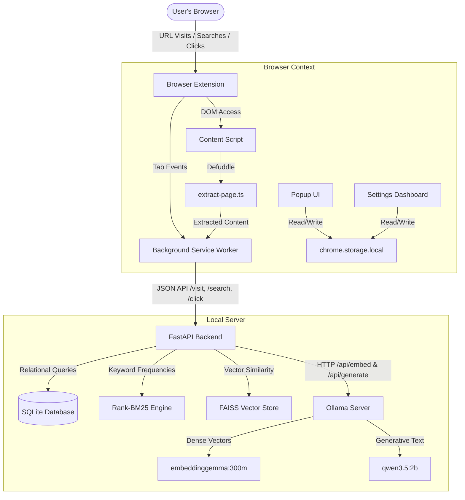
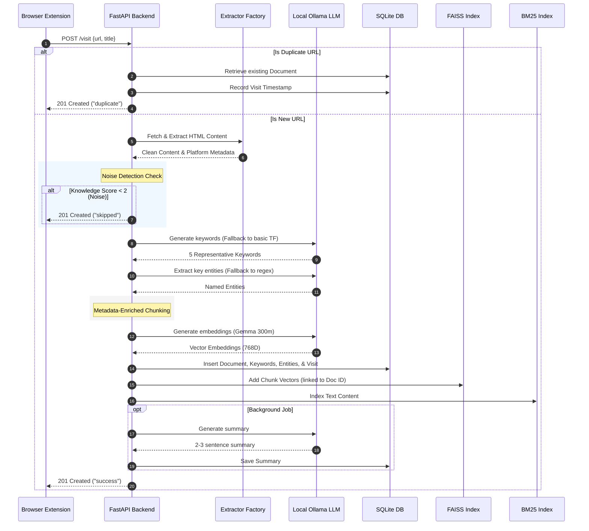
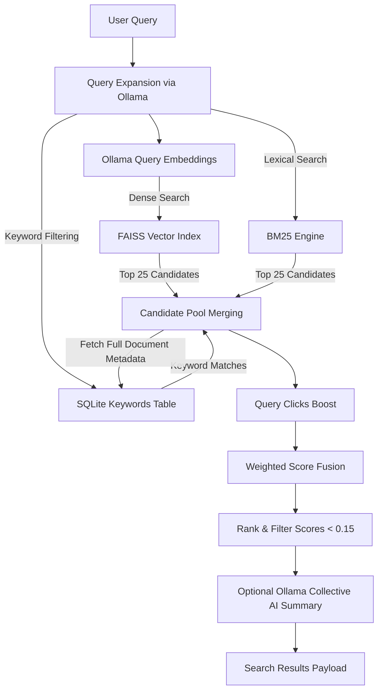

# Architecture

MindCache orchestrates a browser extension with a local FastAPI backend to provide private, AI-powered browsing history search.

## System Context



---

## Extension Modules

### Content Extraction (`src/content/extract-page.ts`)

The content script runs in the page DOM context. When the background worker needs to record a visit, it pings the content script with `"extract-page"`. Extraction uses **Defuddle** (the same library used by Obsidian Web Clipper):

1. **Shadow DOM flattening** — recursively walks all elements, inlines `shadowRoot.innerHTML` so shadow DOM content is accessible.
2. **Noise removal** — strips `<nav>`, `<header>`, `<footer>`, `<aside>`, `<form>`, `[role="navigation"]`, `[role="banner"]`, `.sidebar`, `.cookie` elements.
3. **URL absolutification** — rewrites `src`, `href`, `srcset` attributes to absolute URLs using `document.baseURI`.
4. **Defuddle parsing** — runs `Defuddle.parseAsync()` with an 8-second timeout, falling back to synchronous `Defuddle.parse()` on timeout.
5. **Sanitization** — removes `<script>`, `<style>`, `<noscript>` tags and inline `style` attributes.

The content script also handles `"ping"` (health check), `"toggle-overlay"` (search overlay), and `"extract-selection"` (context menu selection capture).

### Background Service Worker (`src/background/index.ts`)

Monitors tab activations, navigation completions, closures, and window focus changes. Computes exact dwell time per tab.

**Visit filtering** (`shouldTrack()`):
- Protocol must be `http:` or `https:`.
- `autoTracking` setting must be enabled.
- Domain not in user exclusion list.
- Path not in blacklist (`/login`, `/signup`, `/register`, `/logout`, `/reset-password`, `/forgot-password`, `/subscribe`, `/pricing`, `/checkout`, `/cart`, `/wp-admin`, `/admin`).
- File extension not in blacklist (images, media, archives, binaries, documents).

**Dwell time**: 10-second threshold before auto-indexing. Tab deactivation immediately records a visit with actual duration. Duplicate URLs within 10 seconds are suppressed.

**Auto-extraction toggle**: When off, `processVisit()` returns early — no content extraction, no backend call. User must explicitly capture via popup, keybind, or context menu.

**Three capture methods**:
1. Keyboard shortcut `Ctrl+Shift+S` — `chrome.commands.onCommand` → `captureCurrentPage()`.
2. Popup "Save to MindCache" button — runtime message → same `captureCurrentPage()`.
3. Context menu — three items created on install:
   - "Save this page to MindCache" (page context)
   - "Save this link to MindCache" (link context — records basic visit)
   - "Save selection to MindCache" (selection context — extracts selected text)

**Deduplication**: `recentVisits` Map caps at 200 entries, drops duplicates within 10 seconds.

### Spotlight Popup (`src/popup/App.tsx`)

Keyboard-first search window with:
- Backend connection status indicator.
- "Save to MindCache" button (with Sparkles icon) when `autoTracking` or `autoExtract` is off.
- Search results with scores, domain badges, keyword tags, and match badges (Best Match ≥65%, Strong Match ≥55%).

### Settings Dashboard (`src/settings/App.tsx`)

Four-tab interface: Dashboard, Search, Graph, Settings.

**Dashboard**: System stats (documents, vectors, AI model, embedding model, status), recent activity (last 5 pages), backend diagnostics, exclusion count.

**Settings**: Server URL, auto-tracking toggle, auto-extraction toggle, privacy mode, excluded domains list, shortcuts display (keyboard + context menu).

All numeric limits use named constants for easy adjustment:

| Constant | Default | Purpose |
|---|---|---|
| `DEFAULT_RESULT_LIMIT` | 10 | Default search result count |
| `MAX_DOCUMENTS_FETCH` | 100 | Max documents in list query |
| `SEARCH_DEBOUNCE_DELAY` | 250ms | Search input debounce |
| `SAVE_SUCCESS_DURATION` | 1500ms | Success toast duration |
| `RECENT_ACTIVITY_COUNT` | 5 | Dashboard recent items |
| `MAX_KEYWORDS_DISPLAY` | 4 | Max keyword tags per result |
| `GRAPH_DISPLAY_MAX` | 50 | Graph node display cap |
| `BEST_MATCH_THRESHOLD` | 65 | "Best Match" score threshold |
| `STRONG_MATCH_THRESHOLD` | 55 | "Strong Match" score threshold |

### State Management

Three Zustand stores with cross-context sync via `chrome.storage.local`:

- **Settings Store**: Persists user preferences (auto-tracking, auto-extract, backend URL, exclusions, privacy mode).
- **Search Store**: Current query + recent queries.
- **Connection Store**: Backend health status (non-persistent).

The background worker listens for `chrome.storage.onChanged` and calls `rehydrate()` to pick up changes made in the popup or settings page.

### Build Output

| Bundle | Size | Format | Contents |
|---|---|---|---|
| `content.js` | 459KB | IIFE | Defuddle extraction, overlay UI |
| `background.js` | 28KB | IIFE | Service worker, blacklist constants inlined |
| Popup | 9KB | ESM | Spotlight search UI |
| Settings | 87KB | ESM | Full dashboard with knowledge graph |

---

## Backend Ingestion Pipeline

When a visit arrives, the backend processes it through this sequence:



### Client-Side Extraction Bypass

When the extension provides `extracted_content` in the payload, the backend **skips** server-side HTTP download and Trafilatura/BeautifulSoup extraction entirely. This enables indexing of:
- Pages behind authentication or paywalls (user is already logged in).
- JavaScript-rendered SPAs (browser has the rendered DOM).
- Large pages (no server round-trip for download).

When `auto_extract` is `false` and no `extracted_content` is provided, the backend returns `"recorded"` status and skips all processing.

### Server-Side Extraction Fallback

If `extracted_content` is absent, the backend downloads the page via HTTPX and extracts content through:

1. **Trafilatura**: Strips navigation, ads, footers; outputs clean markdown-friendly text with title, author, date.
2. **BeautifulSoup4 fallback**: If Trafilatura returns empty, strips script/style tags and extracts body text.

### Platform-Specific Extractors

Domain-based routing via `ExtractorFactory`:

| Platform | Extractor | Data Source |
|---|---|---|
| YouTube | `YouTubeExtractor` | yt-dlp (metadata) + youtube-transcript-api (captions) |
| X/Twitter | `XExtractor` | CDN syndication API (public tweets) |
| Generic | `GenericExtractor` | Trafilatura / BeautifulSoup4 |

### Noise Detection

Pages are scored on a knowledge quality rubric:
- Word count > 300: +2
- Unique words > 100: +2
- URL path is not root (`/`): +1
- Platform match (GitHub, YouTube, Reddit): +2

Pages scoring < 2 are skipped with `"skipped"` status. Platform search result pages (Google Search, YouTube search) are excluded by path matching.

### Keyword Extraction

Dual-layer strategy:
1. **Ollama prompt**: LLM returns exactly 5 single-word keywords from the page text.
2. **Statistical fallback**: TF-based frequency counter if Ollama is unavailable.

### Entity Extraction

Named entities (Persons, Companies, Technologies, Projects) are extracted via Ollama with regex fallback. Stored in a separate `entities` table linked to documents.

### Chunking

Pages longer than 3000 characters are split into overlapping blocks. Each chunk is prepended with global metadata:

```
Title: {title}
Domain: {domain}
Source Type: {source_type}
Keywords: {k1, k2, ...}
Entities: {name:type, ...}
Content (Chunk X/Y): {text}
```

---

## Retrieval Pipeline



### Weighted Score Fusion

$$\text{base\_score} = 0.45 \cdot V_{\text{score}} + 0.25 \cdot B_{\text{score}} + 0.10 \cdot T_{\text{score}} + 0.05 \cdot K_{\text{score}} + 0.05 \cdot M_{\text{score}} + 0.02 \cdot R_{\text{score}} + 0.03 \cdot S_{\text{score}}$$

| Component | Weight | Description |
|---|---|---|
| Vector Score | 0.45 | FAISS cosine similarity (normalized 0-1) |
| BM25 Score | 0.25 | Lexical score (normalized to max in set) |
| Title Score | 0.10 | Query terms in page title |
| Keyword Score | 0.05 | Query terms in extracted keywords |
| Metadata Score | 0.05 | Query terms in platform metadata |
| Recency Score | 0.02 | `e^{-days/30}` decay function |
| Source Score | 0.03 | GitHub=1.0, YouTube/Reddit/X=0.5, Generic=0.0 |

### Dynamic Document Quality Multiplier

$$\text{final\_score} = \text{base\_score} \cdot (1 + \text{quality\_score} \cdot 0.05)$$

Quality score (0-8) sums: dwell time >60s (+2), word count >500 (+2), high-value source (+2), transcript available (+1), revisit count >1 (+1).

### Rank Overrides

- **Click boost**: +0.10 per same-query click (capped at +0.30).
- **Score floor**: Results below 0.15 are filtered out.

### Embeddings

FAISS `IndexFlatIP` (Inner Product) with L2-normalized vectors. Since both stored and query vectors are unit-length, inner product equals cosine similarity. Uses `embeddinggemma:300m` producing 768-dimensional vectors.

---

## Key Configuration Files

- **[.env](../.env)**: Backend ports, model names, base URL.
- **[config.py](../app/core/config.py)**: Configuration loading and defaults.
- **[main.py](../app/main.py)**: FastAPI app, route registration, lifespan hooks.
- **`extension/public/manifest.json`**: Extension permissions, commands, content script registration.
