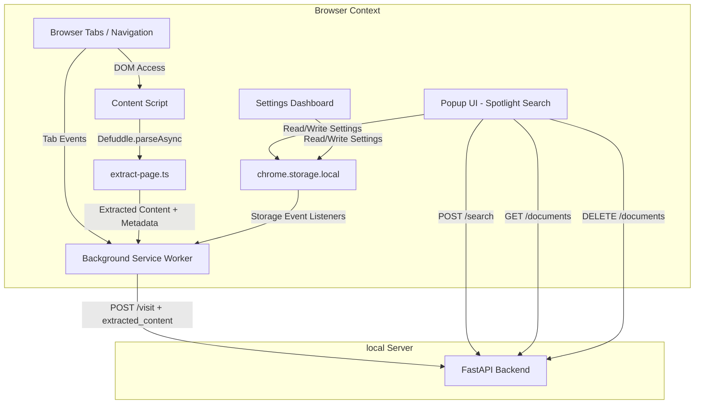

# Extension Architecture

This browser extension serves as the user interface and ingestion gateway for the MindCache personal memory system. It integrates background browser events with a local FastAPI vector search server.

## System Diagram

## Key Modules

### 1. Content Extraction (`src/content/extract-page.ts`)
The content script runs in the page DOM context. When the background worker is about to send a visit to the backend, it pings the content script with `"extract-page"`. The content script uses **Defuddle** (the same library used by Obsidian Web Clipper) to extract:
- Clean markdown and HTML body
- Title, author, description, site name, language, published date
- Schema.org JSON-LD and meta tags
- Current text selection (if any)
- Stored highlights from `localStorage`

Extraction happens synchronously in ~5ms. If the content script is unavailable (e.g. chrome:// pages, PDF viewer), the background worker falls back to the basic URL-only payload.

### 2. Ingestion Worker (`src/background/index.ts`)
The background service worker runs in an isolated browser context. It monitors navigation completes, active tab activations, tab closures, and window focus changes to compute the exact active dwell time (seconds) spent viewing each tab. It filters visits through a validation layer that discards internal pages, localhost, and custom excluded domains. To eliminate transient noise, it auto-indexes standard pages only once a 10-second dwell time threshold is crossed. High-value resources (like PDFs, ArXiv papers, and documentation) bypass this threshold, and platform search pages are conditionally indexed only if the threshold is met.

Before recording a visit, the worker attempts client-side extraction from the content script. If successful, the enriched payload (with `extracted_content`, metadata, schema.org data) is sent to `POST /visit`. The backend then skips HTTP download and uses the provided content directly.

### 3. Spotlight UI (`src/popup/App.tsx`)
A minimal, keyboard-first Spotlight search window. It handles debounced search parameters, keyboard arrow-key navigation, and selection events. It renders matching document cards, domain groups, relevance scores, and custom summaries generated by the local Ollama LLM.

### 4. Settings Control (`src/settings/App.tsx`)
A standalone configuration dashboard accessed through options. It edits the server URL, toggles background tracking, enables privacy filters, and manages domain exclusion strings. It includes live diagnostic checks monitoring database and Ollama availability.

## State Management and Synchronization

State is managed via three separate Zustand stores:
- **Settings Store**: Persists user preferences (Auto Tracking, Backend URL, Excluded Domains) to Chrome Storage.
- **Search Store**: Manages the current query and persists recent queries.
- **Connection Store**: Non-persistent store tracking the health status of local server components.

### Cross-Context State Sync

Because the background worker, popup, and options page run in separate JavaScript runtimes, state mutations do not automatically sync across memory space. 

To bridge this, we implement a custom storage driver using `chrome.storage.local` combined with a listener on `chrome.storage.onChanged`:

1. User alters settings in the Options panel.
2. Settings store writes modifications to `chrome.storage.local`.
3. Background service worker receives the change event and invokes `useSettingsStore.persist.rehydrate()`.
4. Ingestion filters update immediately without requiring worker reloads.
