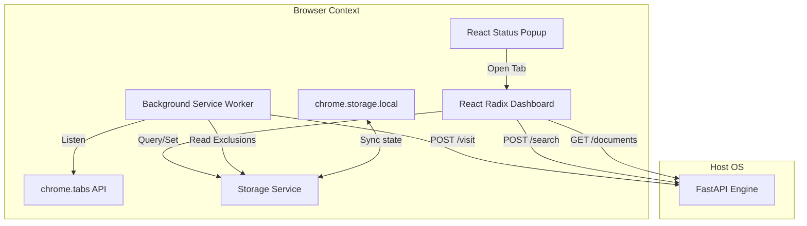

# Extension Architecture

This document describes the structural design and layers of the MindCache browser extension.

## Overview

The browser extension operates as a lightweight, secure agent. It monitors page navigation and tab activations from the background and registers history to the local database. The action popup displays live diagnostic engine status, and includes a trigger to open the full-page Radix UI Dashboard containing semantic search, memory explorers, local RAG chat rooms, and settings.

## Component Architecture

MindCache separates responsibilities into clear modules.

* **Background Service Worker (`src/background/background.ts`)**: Runs continuously in an isolated browser thread. Listens to tab completed states and switches, applies domain exclusions, and dispatches visit signals.
* **Storage Interface (`src/services/storage.ts`)**: Serves as the single thread-safe source of truth. Bridges asynchronous `chrome.storage.local` with standard `localStorage` fallbacks during development.
* **Network Client (`src/services/backendClient.ts`)**: Coordinates API requests. Implements dynamic settings URL loaders, a three-try retry policy, and converts server codes into exceptions.
* **Status Action Popup (`src/App.tsx` & `src/components/BackendStatus.tsx`)**: Displays live project diagnostics (SQLite state, FAISS vector count, Ollama model loaded) and triggers the dashboard opening.
* **Full-Page Dashboard (`src/dashboard/Dashboard.tsx`)**: Renders a sidebar tab navigation using the Radix UI component library. Houses debounced search, memory explorers with deletion, RAG chat rooms, and configuration panels.
* **State Management (`src/store/`)**: Uses Zustand to separate search parameters, connection status, and diagnostic health maps.

## Tab Tracking and Domain Filtering

To protect privacy, the background script filters every webpage URL before dispatching requests.

1. **Protocol Check**: Ignores browser internal interfaces starting with `chrome://`, `edge://`, `chrome-extension://`, `about:`, `file://`, and `view-source:`.
2. **Local Host Check**: Ignores local testing domains like `localhost`, `127.0.0.1`, and private IP blocks (`192.168.*`, `10.*`).
3. **User Exclusion Check**: Matches hostnames against the user's customized domains list. If a domain is listed, tracking ignores it and all its subdomains.
4. **Queue Deduplication**: Stores a rolling memory queue of the last 100 visited URLs. If a URL completion repeats within 10 seconds, the engine discards it to prevent duplicate ingestion pipelines.
