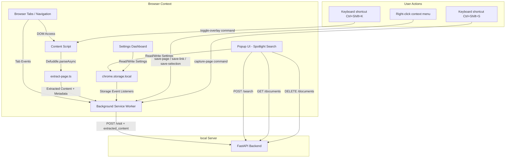

# Extension Architecture

This browser extension serves as the user interface and ingestion gateway for the MindCache personal memory system. It integrates background browser events with a local FastAPI vector search server.

## System Diagram

## Key Modules

### 1. Content Extraction (`src/content/extract-page.ts`)
The content script runs in the page DOM context. When the background worker is about to send a visit to the backend, it pings the content script with `"extract-page"`. The content script uses **Defuddle** (the same library used by Obsidian Web Clipper) to extract:
- Clean markdown and HTML body
- Title, author, description, site name, language, published date
- Schema.org JSON-LD and meta tags
- Current text selection (if any)
- Stored highlights from `localStorage`

Extraction pipeline:
1. **Shadow DOM flattening** — recursively walks all elements, inlines `shadowRoot.innerHTML` into each host element so shadow DOM content is accessible to Defuddle.
2. **Noise removal** — strips `<nav>`, `<header>`, `<footer>`, `<aside>`, `<form>`, `[role="navigation"]`, `[role="banner"]`, `[role="contentinfo"]`, `.sidebar`, `.nav`, `.footer`, `.cookie` elements from the cloned document.
3. **URL absolutification** — rewrites `src`, `href`, and `srcset` attributes to absolute URLs using `document.baseURI`.
4. **Defuddle parsing** — runs `Defuddle.parseAsync()` with an 8-second timeout, falling back to synchronous `Defuddle.parse()` on timeout.
5. **Sanitization** — removes `<script>`, `<style>`, `<noscript>` tags and inline `style` attributes from the full HTML snapshot.

The content script also handles:
- `"ping"` — returns status and URL (used for health checks).
- `"toggle-overlay"` — toggles the search overlay UI (keyboard shortcut target).
- `"extract-selection"` — returns the current user selection as `{ text, html }` (used by the context menu "Save selection to MindCache").

### 2. Background Service Worker (`src/background/index.ts`)
The background service worker runs in an isolated browser context. It monitors navigation completes, active tab activations, tab closures, and window focus changes to compute the exact active dwell time (seconds) spent viewing each tab.

#### Visit Filtering Pipeline
Every URL goes through `shouldTrack()` which checks:
1. Protocol is `http:` or `https:` — not `chrome-extension://` or other internal schemes.
2. `autoTracking` setting is enabled — user can disable automatic tracking entirely.
3. Domain is not in the user's exclusion list.
4. Path is not in the blacklist (`/login`, `/signup`, `/register`, `/logout`, `/reset-password`, `/forgot-password`, `/subscribe`, `/pricing`, `/checkout`, `/cart`, `/wp-admin`, `/admin` and their directory variants).
5. File extension is not in the blacklist (images, media, archives, binaries, documents).

#### Dwell Time Tracking
Tabs have a 10-second dwell threshold before auto-indexing triggers. When a tab is deactivated (closed, switched, window unfocused), the session immediately ends and a visit is recorded with the actual duration. Duplicate visits to the same URL within 10 seconds are suppressed.

#### Auto-Extraction Toggle
When the `autoExtract` setting is off:
- `processVisit()` returns early without extracting content or calling the backend.
- No visit payload is sent during automatic browsing.
- The user must explicitly trigger capture via popup button, context menu, or keyboard shortcut.

#### Capture Methods
Three explicit capture mechanisms bypass the auto-extract gate:

1. **Keyboard shortcut** (`Ctrl+Shift+S`) — registered in manifest.json via `chrome.commands`. The background worker listens on `chrome.commands.onCommand` for `"capture-page"` and calls `captureCurrentPage()`.
2. **Popup "Save to MindCache" button** — sends a `"capture-page"` runtime message which runs the same `captureCurrentPage()` logic. Visible when `autoTracking` or `autoExtract` is off.
3. **Context menu items** — three right-click menu items created on install:
   - `"Save this page to MindCache"` (page context) — extracts and saves the current page.
   - `"Save this link to MindCache"` (link context) — records a basic visit for the link URL (no client-side extraction possible since it's not the current page). Uses `captureUrl()` which calls `backendClient.recordVisit()` with the link URL and zero dwell time.
   - `"Save selection to MindCache"` (selection context) — sends `"extract-selection"` to the content script and saves the selected text/HTML as `extracted_content` and `selection`/`selection_html`.

#### Extraction and Backend Communication
When auto-extract is on and the dwell threshold is crossed, the worker sends `"extract-page"` to the content script with a 2-second timeout. If extraction succeeds, the enriched payload (with `extracted_content`, `extracted_content_html`, metadata, schema.org data, highlights) is sent to `POST /visit`. The backend then skips HTTP download and uses the provided content directly. If extraction is unavailable (e.g. chrome:// pages, PDF viewer, content script not injected), the worker falls back to a basic URL-only payload and the backend downloads the page server-side.

#### Deduplication
A `recentVisits` Map tracks recently processed URLs. Duplicate visits within 10 seconds are dropped. The map is capped at 200 entries.

### 3. Context Menus (`src/background/index.ts`)
On `chrome.runtime.onInstalled`, three context menu items are created:

| Menu Item ID | Context | Title | Action |
|---|---|---|---|
| `save-page` | `page` | "Save this page to MindCache" | Calls `captureCurrentPage()` — extracts full page content and records visit. |
| `save-link` | `link` | "Save this link to MindCache" | Calls `captureUrl()` — records a basic visit with just the URL (server-side download will extract content). |
| `save-selection` | `selection` | "Save selection to MindCache" | Calls `captureSelection()` — sends `"extract-selection"` to content script, saves the selected text as content. |

All three menu items respect the path and extension blacklists via `shouldTrack()`. The `"Save selection"` item requires the content script to be available on the current page.

### 4. Spotlight UI (`src/popup/App.tsx`)
A minimal, keyboard-first Spotlight search window. It handles debounced search parameters, keyboard arrow-key navigation, and selection events. It renders matching document cards, domain groups, relevance scores, and custom summaries generated by the local Ollama LLM. The popup shows:
- A status indicator with the current backend connection status.
- A "Save to MindCache" button (with Sparkles icon) when `autoTracking` or `autoExtract` is off.
- Search results with relevance percentages, domain badges, keyword tags, and match classification (Best Match / Strong Match / Related Result).

### 5. Settings Dashboard (`src/settings/App.tsx`)
A standalone configuration dashboard with four tabs: Dashboard, Search, Graph, and Settings.

**Dashboard tab**: Shows system stats (documents count, vectors, AI model, embedding model, connection status), recent activity (last 5 indexed pages), backend diagnostics, and domain exclusion count.

**Settings tab**: Configured with named constants for all numeric values:
- `DEFAULT_RESULT_LIMIT` (10) — default search result count.
- `SEARCH_DEBOUNCE_DELAY` (250ms) — search input debounce.
- `SAVE_SUCCESS_DURATION` (1500ms) — success toast duration.
- `RECENT_ACTIVITY_COUNT` (5) — recent items shown on dashboard.
- `MAX_KEYWORDS_DISPLAY` (4) — max keyword tags shown per result.
- `GRAPH_DISPLAY_MAX` (50) — max nodes shown in graph label.
- `BEST_MATCH_THRESHOLD` (65) — score percentage for "Best Match" badge.
- `STRONG_MATCH_THRESHOLD` (55) — score percentage for "Strong Match" badge.
- `SCORE_PERCENTAGE_MULTIPLIER` (100) — converts internal 0-1 score to percentage.

**Privacy settings**:
- `autoTracking` toggle — enables/disables automatic tab tracking.
- `autoExtract` toggle — enables/disables automatic content extraction. When off, pages are only saved on explicit user action.
- `privacyMode` toggle — disables search query logging.
- Excluded domains list — comma-separated domain patterns to skip.

**Shortcuts section**: Displays the configured keyboard shortcuts and context menu actions with a link to `chrome://extensions/shortcuts` for customization.

**Search filters**: Result limit, time range, source type, sort order, minimum match score slider.

## State Management and Synchronization

State is managed via three separate Zustand stores:
- **Settings Store**: Persists user preferences (Auto Tracking, Auto Extract, Backend URL, Excluded Domains, Privacy Mode) to Chrome Storage.
- **Search Store**: Manages the current query and persists recent queries.
- **Connection Store**: Non-persistent store tracking the health status of local server components.

### Cross-Context State Sync

Because the background worker, popup, and options page run in separate JavaScript runtimes, state mutations do not automatically sync across memory space.

To bridge this, we implement a custom storage driver using `chrome.storage.local` combined with a listener on `chrome.storage.onChanged`:

1. User alters settings in the Options panel.
2. Settings store writes modifications to `chrome.storage.local`.
3. Background service worker receives the change event and invokes `useSettingsStore.persist.rehydrate()`.
4. Ingestion filters update immediately without requiring worker reloads.

## Build Output

The extension produces four main bundles:
- **`content.js`** (459KB) — content script with Defuddle bundled. Runs in page DOM context.
- **`background.js`** (28KB) — service worker. Inlines blacklist constants to avoid importing Defuddle.
- **`popup`** (9KB) — spotlight search UI.
- **`settings`** (87KB) — full settings dashboard with knowledge graph.
