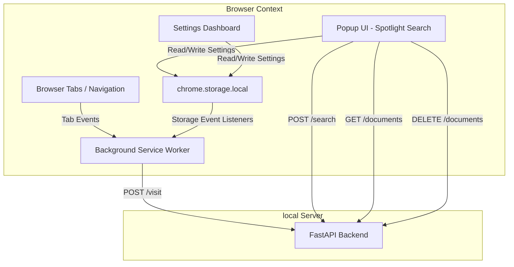

# Extension Architecture

This browser extension serves as the user interface and ingestion gateway for the MindCache personal memory system. It integrates background browser events with a local FastAPI vector search server.

## System Diagram

## Key Modules

### 1. Ingestion Worker (`src/background/index.ts`)
The background service worker runs in an isolated browser context. It monitors navigation complete and active tab switches to capture page titles and URLs. It filters visits through a protocol that discards internal pages, localhost, and custom excluded domains. To prevent database write spam, it buffers events using an in-memory 20-second URL cooldown cache.

### 2. Spotlight UI (`src/popup/App.tsx`)
A minimal, keyboard-first Spotlight search window. It handles debounced search parameters, keyboard arrow-key navigation, and selection events. It renders matching document cards, domain groups, relevance scores, and custom summaries generated by the local Ollama LLM.

### 3. Settings Control (`src/settings/App.tsx`)
A standalone configuration dashboard accessed through options. It edits the server URL, toggles background tracking, enables privacy filters, and manages domain exclusion strings. It includes live diagnostic checks monitoring database and Ollama availability.

## State Management and Synchronization

State is managed via three separate Zustand stores:
- **Settings Store**: Persists user preferences (Auto Tracking, Backend URL, Excluded Domains) to Chrome Storage.
- **Search Store**: Manages the current query and persists recent queries.
- **Connection Store**: Non-persistent store tracking the health status of local server components.

### Cross-Context State Sync

Because the background worker, popup, and options page run in separate JavaScript runtimes, state mutations do not automatically sync across memory space. 

To bridge this, we implement a custom storage driver using `chrome.storage.local` combined with a listener on `chrome.storage.onChanged`:

1. User alters settings in the Options panel.
2. Settings store writes modifications to `chrome.storage.local`.
3. Background service worker receives the change event and invokes `useSettingsStore.persist.rehydrate()`.
4. Ingestion filters update immediately without requiring worker reloads.
